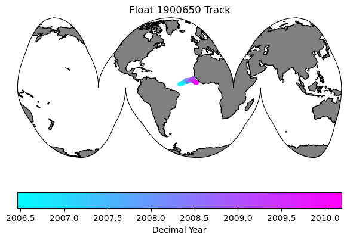
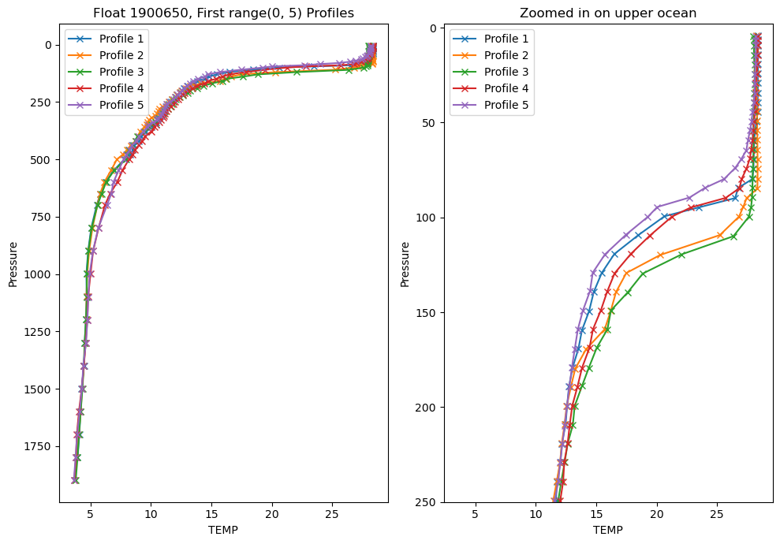
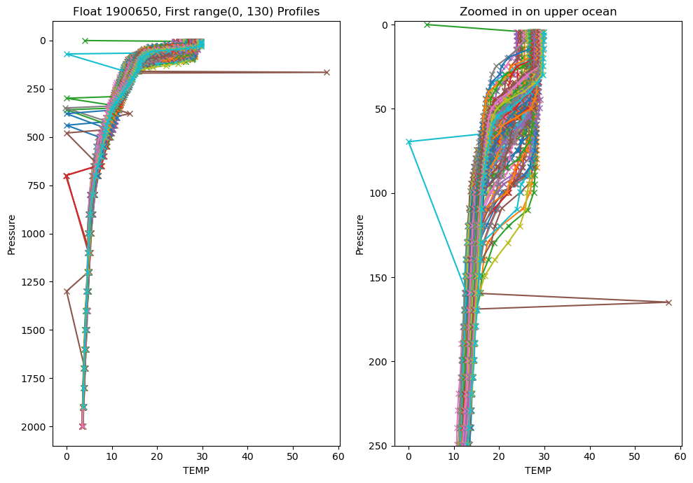
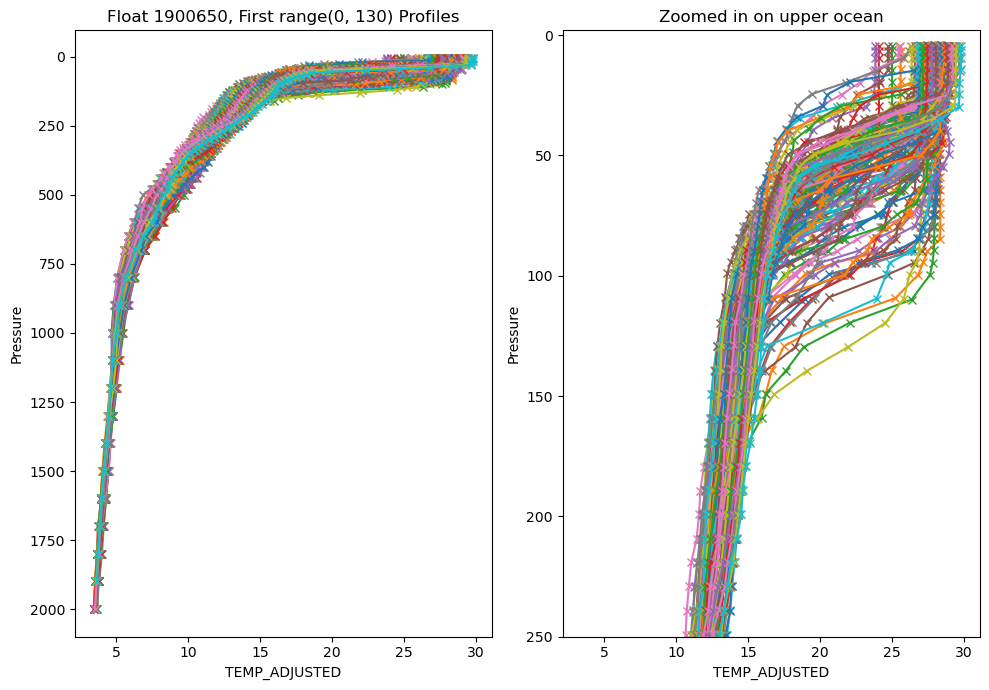
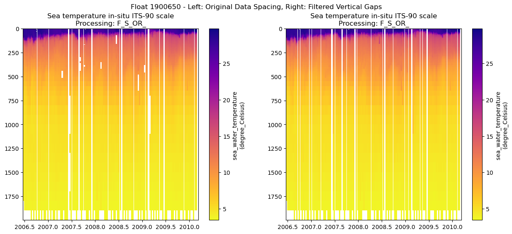
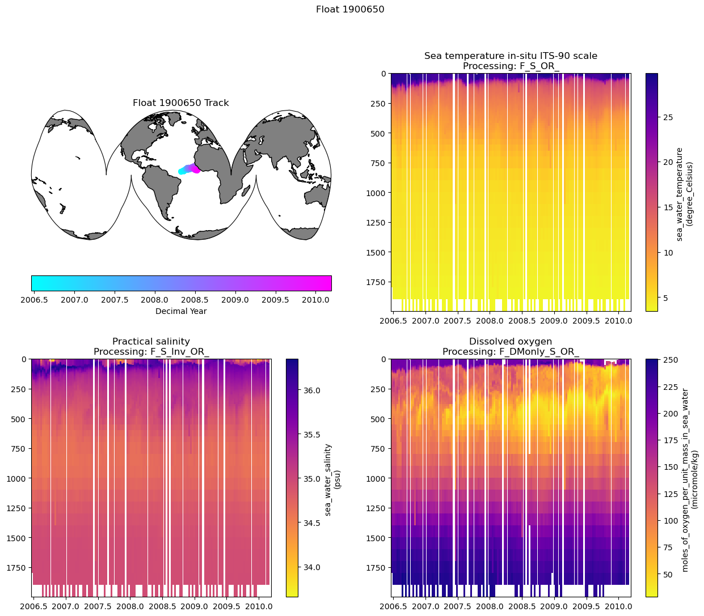

# Examining a float file to see what it contains
#### Contents:
1. Importing packages and setting directories
2. Loading in a single float file
3. Plotting the float track
4. Exploring the float data
    - profile plots
    - section plots
5. Putting it all together and saving out a figure

----
Material by Seth Bushinsky

This material is all in the Jupyter Notebook titled "Float_file_exploration.ipynb" which can be found in the https://github.com/Hi-Cycles/BGC_Argo_Plus_Code_Repository. To run the code yourself, download the script or download/fork/clone the repository. 

You will also need to choose a float file to work with. You can explore float data here: https://www.bgc-argo-plus.info/float_meta_table/ .  Within each individual page there is a link to download the .nc file for the float, or you can access the entire dataset, plus some information about what we've done/changed in the files here: https://www.bgc-argo-plus.info/data-download/ . As of December 2025 this is still an unpublished dataset in testing, so please let me know if you find any issues or have any questions: smb4@hawaii.edu. 

# 1. Setting up your notebook: packages and directories
One of the main differences I found when switching from Matlab to Python was that you had to import packages that you needed for each project. You can either import an entire package (like "import numpy as np") or part of a package (import matplotlib.ticker as mticker). I've commented out some packages that are not currently in use here that I often do use. 


```python
import matplotlib.pyplot as plt
import numpy as np
import pandas as pd
# import os
# import matplotlib.ticker as mticker
import cartopy.crs as ccrs
import cartopy.feature as cfeature
# from scipy import stats
# from tqdm import tqdm
import xarray as xr
```


```python
# Set directories
base_dir = "/Users/sethbushinsky/"

# I store my data and code  in separate directories, adjust as needed
data_dir = base_dir + "UHM_Ocean_BGC_Group Dropbox/Datasets/"
argo_path = data_dir + "Data_Products/BGC_ARGO_GLOBAL/2025_01_24/processed/for_external_sharing/"
glodap_path = data_dir + "Data_Products/GLODAP/"

# path for saving figures, etc
home_dir = base_dir + "UHM_Ocean_BGC_Group Dropbox/Seth Bushinsky/Work/"
figure_dir = home_dir + "Projects/2025_10_BGC_Argo_Plus_Code_examples/plots/"
plot_ver = 'v_1'
```

# 2. Loading an Argo file and examine its contents


```python
# Choose the float file you want to plot:
float_file = '1900650_Sprof_BGCArgoPlus.nc'

```


```python
# load the file and explore the data
# note that xarray has "open_dataset" and "load_dataset" that seem identical. However, open_dataset is "lazy" and only accesses data as needed. "Load_dataset" loads data into memory, which takes more time and resources.

argo_n = xr.open_dataset(argo_path + float_file) 
argo_n
```


<div><svg style="position: absolute; width: 0; height: 0; overflow: hidden">
<defs>
<symbol id="icon-database" viewBox="0 0 32 32">
<path d="M16 0c-8.837 0-16 2.239-16 5v4c0 2.761 7.163 5 16 5s16-2.239 16-5v-4c0-2.761-7.163-5-16-5z"></path>
<path d="M16 17c-8.837 0-16-2.239-16-5v6c0 2.761 7.163 5 16 5s16-2.239 16-5v-6c0 2.761-7.163 5-16 5z"></path>
<path d="M16 26c-8.837 0-16-2.239-16-5v6c0 2.761 7.163 5 16 5s16-2.239 16-5v-6c0 2.761-7.163 5-16 5z"></path>
</symbol>
<symbol id="icon-file-text2" viewBox="0 0 32 32">
<path d="M28.681 7.159c-0.694-0.947-1.662-2.053-2.724-3.116s-2.169-2.030-3.116-2.724c-1.612-1.182-2.393-1.319-2.841-1.319h-15.5c-1.378 0-2.5 1.121-2.5 2.5v27c0 1.378 1.122 2.5 2.5 2.5h23c1.378 0 2.5-1.122 2.5-2.5v-19.5c0-0.448-0.137-1.23-1.319-2.841zM24.543 5.457c0.959 0.959 1.712 1.825 2.268 2.543h-4.811v-4.811c0.718 0.556 1.584 1.309 2.543 2.268zM28 29.5c0 0.271-0.229 0.5-0.5 0.5h-23c-0.271 0-0.5-0.229-0.5-0.5v-27c0-0.271 0.229-0.5 0.5-0.5 0 0 15.499-0 15.5 0v7c0 0.552 0.448 1 1 1h7v19.5z"></path>
<path d="M23 26h-14c-0.552 0-1-0.448-1-1s0.448-1 1-1h14c0.552 0 1 0.448 1 1s-0.448 1-1 1z"></path>
<path d="M23 22h-14c-0.552 0-1-0.448-1-1s0.448-1 1-1h14c0.552 0 1 0.448 1 1s-0.448 1-1 1z"></path>
<path d="M23 18h-14c-0.552 0-1-0.448-1-1s0.448-1 1-1h14c0.552 0 1 0.448 1 1s-0.448 1-1 1z"></path>
</symbol>
</defs>
</svg>
<style>/* CSS stylesheet for displaying xarray objects in jupyterlab.
 *
 */

:root {
  --xr-font-color0: var(--jp-content-font-color0, rgba(0, 0, 0, 1));
  --xr-font-color2: var(--jp-content-font-color2, rgba(0, 0, 0, 0.54));
  --xr-font-color3: var(--jp-content-font-color3, rgba(0, 0, 0, 0.38));
  --xr-border-color: var(--jp-border-color2, #e0e0e0);
  --xr-disabled-color: var(--jp-layout-color3, #bdbdbd);
  --xr-background-color: var(--jp-layout-color0, white);
  --xr-background-color-row-even: var(--jp-layout-color1, white);
  --xr-background-color-row-odd: var(--jp-layout-color2, #eeeeee);
}

html[theme="dark"],
html[data-theme="dark"],
body[data-theme="dark"],
body.vscode-dark {
  --xr-font-color0: rgba(255, 255, 255, 1);
  --xr-font-color2: rgba(255, 255, 255, 0.54);
  --xr-font-color3: rgba(255, 255, 255, 0.38);
  --xr-border-color: #1f1f1f;
  --xr-disabled-color: #515151;
  --xr-background-color: #111111;
  --xr-background-color-row-even: #111111;
  --xr-background-color-row-odd: #313131;
}

.xr-wrap {
  display: block !important;
  min-width: 300px;
  max-width: 700px;
}

.xr-text-repr-fallback {
  /* fallback to plain text repr when CSS is not injected (untrusted notebook) */
  display: none;
}

.xr-header {
  padding-top: 6px;
  padding-bottom: 6px;
  margin-bottom: 4px;
  border-bottom: solid 1px var(--xr-border-color);
}

.xr-header > div,
.xr-header > ul {
  display: inline;
  margin-top: 0;
  margin-bottom: 0;
}

.xr-obj-type,
.xr-array-name {
  margin-left: 2px;
  margin-right: 10px;
}

.xr-obj-type {
  color: var(--xr-font-color2);
}

.xr-sections {
  padding-left: 0 !important;
  display: grid;
  grid-template-columns: 150px auto auto 1fr 0 20px 0 20px;
}

.xr-section-item {
  display: contents;
}

.xr-section-item input {
  display: inline-block;
  opacity: 0;
  height: 0;
}

.xr-section-item input + label {
  color: var(--xr-disabled-color);
}

.xr-section-item input:enabled + label {
  cursor: pointer;
  color: var(--xr-font-color2);
}

.xr-section-item input:focus + label {
  border: 2px solid var(--xr-font-color0);
}

.xr-section-item input:enabled + label:hover {
  color: var(--xr-font-color0);
}

.xr-section-summary {
  grid-column: 1;
  color: var(--xr-font-color2);
  font-weight: 500;
}

.xr-section-summary > span {
  display: inline-block;
  padding-left: 0.5em;
}

.xr-section-summary-in:disabled + label {
  color: var(--xr-font-color2);
}

.xr-section-summary-in + label:before {
  display: inline-block;
  content: "►";
  font-size: 11px;
  width: 15px;
  text-align: center;
}

.xr-section-summary-in:disabled + label:before {
  color: var(--xr-disabled-color);
}

.xr-section-summary-in:checked + label:before {
  content: "▼";
}

.xr-section-summary-in:checked + label > span {
  display: none;
}

.xr-section-summary,
.xr-section-inline-details {
  padding-top: 4px;
  padding-bottom: 4px;
}

.xr-section-inline-details {
  grid-column: 2 / -1;
}

.xr-section-details {
  display: none;
  grid-column: 1 / -1;
  margin-bottom: 5px;
}

.xr-section-summary-in:checked ~ .xr-section-details {
  display: contents;
}

.xr-array-wrap {
  grid-column: 1 / -1;
  display: grid;
  grid-template-columns: 20px auto;
}

.xr-array-wrap > label {
  grid-column: 1;
  vertical-align: top;
}

.xr-preview {
  color: var(--xr-font-color3);
}

.xr-array-preview,
.xr-array-data {
  padding: 0 5px !important;
  grid-column: 2;
}

.xr-array-data,
.xr-array-in:checked ~ .xr-array-preview {
  display: none;
}

.xr-array-in:checked ~ .xr-array-data,
.xr-array-preview {
  display: inline-block;
}

.xr-dim-list {
  display: inline-block !important;
  list-style: none;
  padding: 0 !important;
  margin: 0;
}

.xr-dim-list li {
  display: inline-block;
  padding: 0;
  margin: 0;
}

.xr-dim-list:before {
  content: "(";
}

.xr-dim-list:after {
  content: ")";
}

.xr-dim-list li:not(:last-child):after {
  content: ",";
  padding-right: 5px;
}

.xr-has-index {
  font-weight: bold;
}

.xr-var-list,
.xr-var-item {
  display: contents;
}

.xr-var-item > div,
.xr-var-item label,
.xr-var-item > .xr-var-name span {
  background-color: var(--xr-background-color-row-even);
  margin-bottom: 0;
}

.xr-var-item > .xr-var-name:hover span {
  padding-right: 5px;
}

.xr-var-list > li:nth-child(odd) > div,
.xr-var-list > li:nth-child(odd) > label,
.xr-var-list > li:nth-child(odd) > .xr-var-name span {
  background-color: var(--xr-background-color-row-odd);
}

.xr-var-name {
  grid-column: 1;
}

.xr-var-dims {
  grid-column: 2;
}

.xr-var-dtype {
  grid-column: 3;
  text-align: right;
  color: var(--xr-font-color2);
}

.xr-var-preview {
  grid-column: 4;
}

.xr-index-preview {
  grid-column: 2 / 5;
  color: var(--xr-font-color2);
}

.xr-var-name,
.xr-var-dims,
.xr-var-dtype,
.xr-preview,
.xr-attrs dt {
  white-space: nowrap;
  overflow: hidden;
  text-overflow: ellipsis;
  padding-right: 10px;
}

.xr-var-name:hover,
.xr-var-dims:hover,
.xr-var-dtype:hover,
.xr-attrs dt:hover {
  overflow: visible;
  width: auto;
  z-index: 1;
}

.xr-var-attrs,
.xr-var-data,
.xr-index-data {
  display: none;
  background-color: var(--xr-background-color) !important;
  padding-bottom: 5px !important;
}

.xr-var-attrs-in:checked ~ .xr-var-attrs,
.xr-var-data-in:checked ~ .xr-var-data,
.xr-index-data-in:checked ~ .xr-index-data {
  display: block;
}

.xr-var-data > table {
  float: right;
}

.xr-var-name span,
.xr-var-data,
.xr-index-name div,
.xr-index-data,
.xr-attrs {
  padding-left: 25px !important;
}

.xr-attrs,
.xr-var-attrs,
.xr-var-data,
.xr-index-data {
  grid-column: 1 / -1;
}

dl.xr-attrs {
  padding: 0;
  margin: 0;
  display: grid;
  grid-template-columns: 125px auto;
}

.xr-attrs dt,
.xr-attrs dd {
  padding: 0;
  margin: 0;
  float: left;
  padding-right: 10px;
  width: auto;
}

.xr-attrs dt {
  font-weight: normal;
  grid-column: 1;
}

.xr-attrs dt:hover span {
  display: inline-block;
  background: var(--xr-background-color);
  padding-right: 10px;
}

.xr-attrs dd {
  grid-column: 2;
  white-space: pre-wrap;
  word-break: break-all;
}

.xr-icon-database,
.xr-icon-file-text2,
.xr-no-icon {
  display: inline-block;
  vertical-align: middle;
  width: 1em;
  height: 1.5em !important;
  stroke-width: 0;
  stroke: currentColor;
  fill: currentColor;
}
</style><pre class='xr-text-repr-fallback'>&lt;xarray.Dataset&gt; Size: 2MB
Dimensions:                         (N_PROF: 130, N_PARAM: 4, N_CALIB: 2,
                                     N_LEVELS: 71)
Coordinates:
    JULD                            (N_PROF) datetime64[ns] 1kB ...
    LATITUDE                        (N_PROF) float64 1kB ...
    LONGITUDE                       (N_PROF) float64 1kB ...
    PRES_ADJUSTED_BGCArgoPlus       (N_PROF, N_LEVELS) float32 37kB ...
  * N_LEVELS                        (N_LEVELS) int64 568B 0 1 2 3 ... 68 69 70
  * N_PROF                          (N_PROF) int64 1kB 0 1 2 3 ... 127 128 129
Dimensions without coordinates: N_PARAM, N_CALIB
Data variables: (12/76)
    DATA_TYPE                       object 8B ...
    FORMAT_VERSION                  object 8B ...
    HANDBOOK_VERSION                object 8B ...
    REFERENCE_DATE_TIME             object 8B ...
    DATE_CREATION                   object 8B ...
    DATE_UPDATE                     object 8B ...
    ...                              ...
    spiciness0                      (N_PROF, N_LEVELS) float64 74kB ...
    cons_temp                       (N_PROF, N_LEVELS) float64 74kB ...
    gamma                           (N_PROF, N_LEVELS) float64 74kB ...
    depth                           (N_PROF, N_LEVELS) float64 74kB ...
    MLD                             (N_PROF) float64 1kB ...
    DOXY_SAT                        (N_PROF, N_LEVELS) float64 74kB ...
Attributes:
    title:                Argo float vertical profile
    institution:          CORIOLIS
    source:               Argo float
    history:              2024-07-15T14:29:53Z creation (software version 1.1...
    references:           http://www.argodatamgt.org/Documentation
    user_manual_version:  1.0
    Conventions:          Argo-3.1 CF-1.6
    featureType:          trajectoryProfile
    software_version:     1.18 (version 11.01.2024 for ARGO_simplified_profile)
    id:                   https://doi.org/10.17882/42182</pre><div class='xr-wrap' style='display:none'><div class='xr-header'><div class='xr-obj-type'>xarray.Dataset</div></div><ul class='xr-sections'><li class='xr-section-item'><input id='section-f9a94445-f200-4cb5-8e1c-c38ed2f7ec46' class='xr-section-summary-in' type='checkbox' disabled ><label for='section-f9a94445-f200-4cb5-8e1c-c38ed2f7ec46' class='xr-section-summary'  title='Expand/collapse section'>Dimensions:</label><div class='xr-section-inline-details'><ul class='xr-dim-list'><li><span class='xr-has-index'>N_PROF</span>: 130</li><li><span>N_PARAM</span>: 4</li><li><span>N_CALIB</span>: 2</li><li><span class='xr-has-index'>N_LEVELS</span>: 71</li></ul></div><div class='xr-section-details'></div></li><li class='xr-section-item'><input id='section-8942b846-4e98-4bc7-bd71-e8d003d46761' class='xr-section-summary-in' type='checkbox'  checked><label for='section-8942b846-4e98-4bc7-bd71-e8d003d46761' class='xr-section-summary' >Coordinates: <span>(6)</span></label><div class='xr-section-inline-details'></div><div class='xr-section-details'><ul class='xr-var-list'><li class='xr-var-item'><div class='xr-var-name'><span>JULD</span></div><div class='xr-var-dims'>(N_PROF)</div><div class='xr-var-dtype'>datetime64[ns]</div><div class='xr-var-preview xr-preview'>...</div><input id='attrs-0f0d2edb-49e7-466f-842b-c7394ac0772d' class='xr-var-attrs-in' type='checkbox' ><label for='attrs-0f0d2edb-49e7-466f-842b-c7394ac0772d' title='Show/Hide attributes'><svg class='icon xr-icon-file-text2'><use xlink:href='#icon-file-text2'></use></svg></label><input id='data-004de06b-2581-48c3-b9de-28feaefafbe2' class='xr-var-data-in' type='checkbox'><label for='data-004de06b-2581-48c3-b9de-28feaefafbe2' title='Show/Hide data repr'><svg class='icon xr-icon-database'><use xlink:href='#icon-database'></use></svg></label><div class='xr-var-attrs'><dl class='xr-attrs'><dt><span>long_name :</span></dt><dd>Julian day (UTC) of the station relative to REFERENCE_DATE_TIME</dd><dt><span>standard_name :</span></dt><dd>time</dd><dt><span>conventions :</span></dt><dd>Relative julian days with decimal part (as parts of day)</dd><dt><span>axis :</span></dt><dd>T</dd><dt><span>resolution :</span></dt><dd>1.1574074074074073e-05</dd></dl></div><div class='xr-var-data'><pre>[130 values with dtype=datetime64[ns]]</pre></div></li><li class='xr-var-item'><div class='xr-var-name'><span>LATITUDE</span></div><div class='xr-var-dims'>(N_PROF)</div><div class='xr-var-dtype'>float64</div><div class='xr-var-preview xr-preview'>...</div><input id='attrs-92f483d2-8839-4563-b96e-1ff35a58b709' class='xr-var-attrs-in' type='checkbox' ><label for='attrs-92f483d2-8839-4563-b96e-1ff35a58b709' title='Show/Hide attributes'><svg class='icon xr-icon-file-text2'><use xlink:href='#icon-file-text2'></use></svg></label><input id='data-b0144a97-a1d0-4c9c-963b-4e5f5889d688' class='xr-var-data-in' type='checkbox'><label for='data-b0144a97-a1d0-4c9c-963b-4e5f5889d688' title='Show/Hide data repr'><svg class='icon xr-icon-database'><use xlink:href='#icon-database'></use></svg></label><div class='xr-var-attrs'><dl class='xr-attrs'><dt><span>long_name :</span></dt><dd>Latitude of the station, best estimate</dd><dt><span>standard_name :</span></dt><dd>latitude</dd><dt><span>units :</span></dt><dd>degree_north</dd><dt><span>valid_min :</span></dt><dd>-90.0</dd><dt><span>valid_max :</span></dt><dd>90.0</dd><dt><span>axis :</span></dt><dd>Y</dd></dl></div><div class='xr-var-data'><pre>[130 values with dtype=float64]</pre></div></li><li class='xr-var-item'><div class='xr-var-name'><span>LONGITUDE</span></div><div class='xr-var-dims'>(N_PROF)</div><div class='xr-var-dtype'>float64</div><div class='xr-var-preview xr-preview'>...</div><input id='attrs-1b286c9a-cf58-4486-a224-ea395adc9228' class='xr-var-attrs-in' type='checkbox' ><label for='attrs-1b286c9a-cf58-4486-a224-ea395adc9228' title='Show/Hide attributes'><svg class='icon xr-icon-file-text2'><use xlink:href='#icon-file-text2'></use></svg></label><input id='data-232e9a6e-9a3b-4067-82e6-48a3e9dc026d' class='xr-var-data-in' type='checkbox'><label for='data-232e9a6e-9a3b-4067-82e6-48a3e9dc026d' title='Show/Hide data repr'><svg class='icon xr-icon-database'><use xlink:href='#icon-database'></use></svg></label><div class='xr-var-attrs'><dl class='xr-attrs'><dt><span>long_name :</span></dt><dd>Longitude of the station, best estimate</dd><dt><span>standard_name :</span></dt><dd>longitude</dd><dt><span>units :</span></dt><dd>degree_east</dd><dt><span>valid_min :</span></dt><dd>-180.0</dd><dt><span>valid_max :</span></dt><dd>180.0</dd><dt><span>axis :</span></dt><dd>X</dd></dl></div><div class='xr-var-data'><pre>[130 values with dtype=float64]</pre></div></li><li class='xr-var-item'><div class='xr-var-name'><span>PRES_ADJUSTED_BGCArgoPlus</span></div><div class='xr-var-dims'>(N_PROF, N_LEVELS)</div><div class='xr-var-dtype'>float32</div><div class='xr-var-preview xr-preview'>...</div><input id='attrs-5fa9ccf0-32f7-4210-9f10-42ed1608a84a' class='xr-var-attrs-in' type='checkbox' ><label for='attrs-5fa9ccf0-32f7-4210-9f10-42ed1608a84a' title='Show/Hide attributes'><svg class='icon xr-icon-file-text2'><use xlink:href='#icon-file-text2'></use></svg></label><input id='data-12940772-7c33-43c0-8bb0-11e8f4841fa5' class='xr-var-data-in' type='checkbox'><label for='data-12940772-7c33-43c0-8bb0-11e8f4841fa5' title='Show/Hide data repr'><svg class='icon xr-icon-database'><use xlink:href='#icon-database'></use></svg></label><div class='xr-var-attrs'><dl class='xr-attrs'><dt><span>long_name :</span></dt><dd>Sea water pressure, equals 0 at sea-level</dd><dt><span>standard_name :</span></dt><dd>sea_water_pressure</dd><dt><span>units :</span></dt><dd>decibar</dd><dt><span>valid_min :</span></dt><dd>0.0</dd><dt><span>valid_max :</span></dt><dd>12000.0</dd><dt><span>C_format :</span></dt><dd>%.3f</dd><dt><span>FORTRAN_format :</span></dt><dd>F.3</dd><dt><span>resolution :</span></dt><dd>0.001</dd><dt><span>axis :</span></dt><dd>Z</dd></dl></div><div class='xr-var-data'><pre>[9230 values with dtype=float32]</pre></div></li><li class='xr-var-item'><div class='xr-var-name'><span class='xr-has-index'>N_LEVELS</span></div><div class='xr-var-dims'>(N_LEVELS)</div><div class='xr-var-dtype'>int64</div><div class='xr-var-preview xr-preview'>0 1 2 3 4 5 6 ... 65 66 67 68 69 70</div><input id='attrs-b43f676f-bd0b-44f0-8ed5-bd0bcac09188' class='xr-var-attrs-in' type='checkbox' disabled><label for='attrs-b43f676f-bd0b-44f0-8ed5-bd0bcac09188' title='Show/Hide attributes'><svg class='icon xr-icon-file-text2'><use xlink:href='#icon-file-text2'></use></svg></label><input id='data-e7737ac6-7f5a-4317-9957-8835d7299ac0' class='xr-var-data-in' type='checkbox'><label for='data-e7737ac6-7f5a-4317-9957-8835d7299ac0' title='Show/Hide data repr'><svg class='icon xr-icon-database'><use xlink:href='#icon-database'></use></svg></label><div class='xr-var-attrs'><dl class='xr-attrs'></dl></div><div class='xr-var-data'><pre>array([ 0,  1,  2,  3,  4,  5,  6,  7,  8,  9, 10, 11, 12, 13, 14, 15, 16, 17,
       18, 19, 20, 21, 22, 23, 24, 25, 26, 27, 28, 29, 30, 31, 32, 33, 34, 35,
       36, 37, 38, 39, 40, 41, 42, 43, 44, 45, 46, 47, 48, 49, 50, 51, 52, 53,
       54, 55, 56, 57, 58, 59, 60, 61, 62, 63, 64, 65, 66, 67, 68, 69, 70])</pre></div></li><li class='xr-var-item'><div class='xr-var-name'><span class='xr-has-index'>N_PROF</span></div><div class='xr-var-dims'>(N_PROF)</div><div class='xr-var-dtype'>int64</div><div class='xr-var-preview xr-preview'>0 1 2 3 4 5 ... 125 126 127 128 129</div><input id='attrs-0526460c-88f4-47ef-9202-8516f1557a1a' class='xr-var-attrs-in' type='checkbox' disabled><label for='attrs-0526460c-88f4-47ef-9202-8516f1557a1a' title='Show/Hide attributes'><svg class='icon xr-icon-file-text2'><use xlink:href='#icon-file-text2'></use></svg></label><input id='data-9758943a-ac9c-44c7-a515-9846ebbd93aa' class='xr-var-data-in' type='checkbox'><label for='data-9758943a-ac9c-44c7-a515-9846ebbd93aa' title='Show/Hide data repr'><svg class='icon xr-icon-database'><use xlink:href='#icon-database'></use></svg></label><div class='xr-var-attrs'><dl class='xr-attrs'></dl></div><div class='xr-var-data'><pre>array([  0,   1,   2,   3,   4,   5,   6,   7,   8,   9,  10,  11,  12,  13,
        14,  15,  16,  17,  18,  19,  20,  21,  22,  23,  24,  25,  26,  27,
        28,  29,  30,  31,  32,  33,  34,  35,  36,  37,  38,  39,  40,  41,
        42,  43,  44,  45,  46,  47,  48,  49,  50,  51,  52,  53,  54,  55,
        56,  57,  58,  59,  60,  61,  62,  63,  64,  65,  66,  67,  68,  69,
        70,  71,  72,  73,  74,  75,  76,  77,  78,  79,  80,  81,  82,  83,
        84,  85,  86,  87,  88,  89,  90,  91,  92,  93,  94,  95,  96,  97,
        98,  99, 100, 101, 102, 103, 104, 105, 106, 107, 108, 109, 110, 111,
       112, 113, 114, 115, 116, 117, 118, 119, 120, 121, 122, 123, 124, 125,
       126, 127, 128, 129])</pre></div></li></ul></div></li><li class='xr-section-item'><input id='section-aae61e1c-5f9d-4d2c-976d-29bd241cca7c' class='xr-section-summary-in' type='checkbox'  ><label for='section-aae61e1c-5f9d-4d2c-976d-29bd241cca7c' class='xr-section-summary' >Data variables: <span>(76)</span></label><div class='xr-section-inline-details'></div><div class='xr-section-details'><ul class='xr-var-list'><li class='xr-var-item'><div class='xr-var-name'><span>DATA_TYPE</span></div><div class='xr-var-dims'>()</div><div class='xr-var-dtype'>object</div><div class='xr-var-preview xr-preview'>...</div><input id='attrs-30f58110-7821-4907-baed-9af079ceef31' class='xr-var-attrs-in' type='checkbox' ><label for='attrs-30f58110-7821-4907-baed-9af079ceef31' title='Show/Hide attributes'><svg class='icon xr-icon-file-text2'><use xlink:href='#icon-file-text2'></use></svg></label><input id='data-e0ea9b0f-038c-475e-a299-fb0eaf9c570e' class='xr-var-data-in' type='checkbox'><label for='data-e0ea9b0f-038c-475e-a299-fb0eaf9c570e' title='Show/Hide data repr'><svg class='icon xr-icon-database'><use xlink:href='#icon-database'></use></svg></label><div class='xr-var-attrs'><dl class='xr-attrs'><dt><span>long_name :</span></dt><dd>Data type</dd><dt><span>conventions :</span></dt><dd>Argo reference table 1</dd></dl></div><div class='xr-var-data'><pre>[1 values with dtype=object]</pre></div></li><li class='xr-var-item'><div class='xr-var-name'><span>FORMAT_VERSION</span></div><div class='xr-var-dims'>()</div><div class='xr-var-dtype'>object</div><div class='xr-var-preview xr-preview'>...</div><input id='attrs-f18cbf25-37c8-427f-a40a-3951bda6dbab' class='xr-var-attrs-in' type='checkbox' ><label for='attrs-f18cbf25-37c8-427f-a40a-3951bda6dbab' title='Show/Hide attributes'><svg class='icon xr-icon-file-text2'><use xlink:href='#icon-file-text2'></use></svg></label><input id='data-5a3944bb-fe22-4110-9d42-c3293036acc0' class='xr-var-data-in' type='checkbox'><label for='data-5a3944bb-fe22-4110-9d42-c3293036acc0' title='Show/Hide data repr'><svg class='icon xr-icon-database'><use xlink:href='#icon-database'></use></svg></label><div class='xr-var-attrs'><dl class='xr-attrs'><dt><span>long_name :</span></dt><dd>File format version</dd></dl></div><div class='xr-var-data'><pre>[1 values with dtype=object]</pre></div></li><li class='xr-var-item'><div class='xr-var-name'><span>HANDBOOK_VERSION</span></div><div class='xr-var-dims'>()</div><div class='xr-var-dtype'>object</div><div class='xr-var-preview xr-preview'>...</div><input id='attrs-dd2f4543-4b06-486d-ae45-5eb79f484765' class='xr-var-attrs-in' type='checkbox' ><label for='attrs-dd2f4543-4b06-486d-ae45-5eb79f484765' title='Show/Hide attributes'><svg class='icon xr-icon-file-text2'><use xlink:href='#icon-file-text2'></use></svg></label><input id='data-a84029e6-e660-4317-ab35-9a91b3768431' class='xr-var-data-in' type='checkbox'><label for='data-a84029e6-e660-4317-ab35-9a91b3768431' title='Show/Hide data repr'><svg class='icon xr-icon-database'><use xlink:href='#icon-database'></use></svg></label><div class='xr-var-attrs'><dl class='xr-attrs'><dt><span>long_name :</span></dt><dd>Data handbook version</dd></dl></div><div class='xr-var-data'><pre>[1 values with dtype=object]</pre></div></li><li class='xr-var-item'><div class='xr-var-name'><span>REFERENCE_DATE_TIME</span></div><div class='xr-var-dims'>()</div><div class='xr-var-dtype'>object</div><div class='xr-var-preview xr-preview'>...</div><input id='attrs-dab9d706-c05a-4138-9a1b-d89a8626020f' class='xr-var-attrs-in' type='checkbox' ><label for='attrs-dab9d706-c05a-4138-9a1b-d89a8626020f' title='Show/Hide attributes'><svg class='icon xr-icon-file-text2'><use xlink:href='#icon-file-text2'></use></svg></label><input id='data-60c1a9e7-3f6a-40f1-9c51-2aee4761903f' class='xr-var-data-in' type='checkbox'><label for='data-60c1a9e7-3f6a-40f1-9c51-2aee4761903f' title='Show/Hide data repr'><svg class='icon xr-icon-database'><use xlink:href='#icon-database'></use></svg></label><div class='xr-var-attrs'><dl class='xr-attrs'><dt><span>long_name :</span></dt><dd>Date of reference for Julian days</dd><dt><span>conventions :</span></dt><dd>YYYYMMDDHHMISS</dd></dl></div><div class='xr-var-data'><pre>[1 values with dtype=object]</pre></div></li><li class='xr-var-item'><div class='xr-var-name'><span>DATE_CREATION</span></div><div class='xr-var-dims'>()</div><div class='xr-var-dtype'>object</div><div class='xr-var-preview xr-preview'>...</div><input id='attrs-946917a3-9181-4abf-9a81-cf5aa63328bf' class='xr-var-attrs-in' type='checkbox' ><label for='attrs-946917a3-9181-4abf-9a81-cf5aa63328bf' title='Show/Hide attributes'><svg class='icon xr-icon-file-text2'><use xlink:href='#icon-file-text2'></use></svg></label><input id='data-2d56eccc-3f75-4c37-9a15-1aa8d1f9032b' class='xr-var-data-in' type='checkbox'><label for='data-2d56eccc-3f75-4c37-9a15-1aa8d1f9032b' title='Show/Hide data repr'><svg class='icon xr-icon-database'><use xlink:href='#icon-database'></use></svg></label><div class='xr-var-attrs'><dl class='xr-attrs'><dt><span>long_name :</span></dt><dd>Date of file creation</dd><dt><span>conventions :</span></dt><dd>YYYYMMDDHHMISS</dd></dl></div><div class='xr-var-data'><pre>[1 values with dtype=object]</pre></div></li><li class='xr-var-item'><div class='xr-var-name'><span>DATE_UPDATE</span></div><div class='xr-var-dims'>()</div><div class='xr-var-dtype'>object</div><div class='xr-var-preview xr-preview'>...</div><input id='attrs-d2782ca2-bf93-4309-9f8f-edcfc732b446' class='xr-var-attrs-in' type='checkbox' ><label for='attrs-d2782ca2-bf93-4309-9f8f-edcfc732b446' title='Show/Hide attributes'><svg class='icon xr-icon-file-text2'><use xlink:href='#icon-file-text2'></use></svg></label><input id='data-68c5271d-156c-4415-8f37-c9e50419444f' class='xr-var-data-in' type='checkbox'><label for='data-68c5271d-156c-4415-8f37-c9e50419444f' title='Show/Hide data repr'><svg class='icon xr-icon-database'><use xlink:href='#icon-database'></use></svg></label><div class='xr-var-attrs'><dl class='xr-attrs'><dt><span>long_name :</span></dt><dd>Date of update of this file</dd><dt><span>conventions :</span></dt><dd>YYYYMMDDHHMISS</dd></dl></div><div class='xr-var-data'><pre>[1 values with dtype=object]</pre></div></li><li class='xr-var-item'><div class='xr-var-name'><span>PLATFORM_NUMBER</span></div><div class='xr-var-dims'>(N_PROF)</div><div class='xr-var-dtype'>object</div><div class='xr-var-preview xr-preview'>...</div><input id='attrs-980ffd2a-313d-4a59-a545-1c687c726927' class='xr-var-attrs-in' type='checkbox' ><label for='attrs-980ffd2a-313d-4a59-a545-1c687c726927' title='Show/Hide attributes'><svg class='icon xr-icon-file-text2'><use xlink:href='#icon-file-text2'></use></svg></label><input id='data-8bc10a5f-2cd2-4dc7-8c55-4a0a7e5b56ca' class='xr-var-data-in' type='checkbox'><label for='data-8bc10a5f-2cd2-4dc7-8c55-4a0a7e5b56ca' title='Show/Hide data repr'><svg class='icon xr-icon-database'><use xlink:href='#icon-database'></use></svg></label><div class='xr-var-attrs'><dl class='xr-attrs'><dt><span>long_name :</span></dt><dd>Float unique identifier</dd><dt><span>conventions :</span></dt><dd>WMO float identifier : A9IIIII</dd></dl></div><div class='xr-var-data'><pre>[130 values with dtype=object]</pre></div></li><li class='xr-var-item'><div class='xr-var-name'><span>PROJECT_NAME</span></div><div class='xr-var-dims'>(N_PROF)</div><div class='xr-var-dtype'>object</div><div class='xr-var-preview xr-preview'>...</div><input id='attrs-bb03d09c-6909-45cf-b5d8-99f6b8f9a53b' class='xr-var-attrs-in' type='checkbox' ><label for='attrs-bb03d09c-6909-45cf-b5d8-99f6b8f9a53b' title='Show/Hide attributes'><svg class='icon xr-icon-file-text2'><use xlink:href='#icon-file-text2'></use></svg></label><input id='data-8db08cb1-dc32-4978-a5b8-067de8cab52a' class='xr-var-data-in' type='checkbox'><label for='data-8db08cb1-dc32-4978-a5b8-067de8cab52a' title='Show/Hide data repr'><svg class='icon xr-icon-database'><use xlink:href='#icon-database'></use></svg></label><div class='xr-var-attrs'><dl class='xr-attrs'><dt><span>long_name :</span></dt><dd>Name of the project</dd></dl></div><div class='xr-var-data'><pre>[130 values with dtype=object]</pre></div></li><li class='xr-var-item'><div class='xr-var-name'><span>PI_NAME</span></div><div class='xr-var-dims'>(N_PROF)</div><div class='xr-var-dtype'>object</div><div class='xr-var-preview xr-preview'>...</div><input id='attrs-95259c34-2af1-4f4a-b161-7029e8f37be1' class='xr-var-attrs-in' type='checkbox' ><label for='attrs-95259c34-2af1-4f4a-b161-7029e8f37be1' title='Show/Hide attributes'><svg class='icon xr-icon-file-text2'><use xlink:href='#icon-file-text2'></use></svg></label><input id='data-689d8a08-02b8-4767-8cc3-85583a95222f' class='xr-var-data-in' type='checkbox'><label for='data-689d8a08-02b8-4767-8cc3-85583a95222f' title='Show/Hide data repr'><svg class='icon xr-icon-database'><use xlink:href='#icon-database'></use></svg></label><div class='xr-var-attrs'><dl class='xr-attrs'><dt><span>long_name :</span></dt><dd>Name of the principal investigator</dd></dl></div><div class='xr-var-data'><pre>[130 values with dtype=object]</pre></div></li><li class='xr-var-item'><div class='xr-var-name'><span>STATION_PARAMETERS</span></div><div class='xr-var-dims'>(N_PROF, N_PARAM)</div><div class='xr-var-dtype'>object</div><div class='xr-var-preview xr-preview'>...</div><input id='attrs-f3ddaea2-2ddb-421b-afa6-d30e7c8467a3' class='xr-var-attrs-in' type='checkbox' ><label for='attrs-f3ddaea2-2ddb-421b-afa6-d30e7c8467a3' title='Show/Hide attributes'><svg class='icon xr-icon-file-text2'><use xlink:href='#icon-file-text2'></use></svg></label><input id='data-037a05d2-efc3-49af-af38-de93398bcb69' class='xr-var-data-in' type='checkbox'><label for='data-037a05d2-efc3-49af-af38-de93398bcb69' title='Show/Hide data repr'><svg class='icon xr-icon-database'><use xlink:href='#icon-database'></use></svg></label><div class='xr-var-attrs'><dl class='xr-attrs'><dt><span>long_name :</span></dt><dd>List of available parameters for the station</dd><dt><span>conventions :</span></dt><dd>Argo reference table 3</dd></dl></div><div class='xr-var-data'><pre>[520 values with dtype=object]</pre></div></li><li class='xr-var-item'><div class='xr-var-name'><span>CYCLE_NUMBER</span></div><div class='xr-var-dims'>(N_PROF)</div><div class='xr-var-dtype'>float64</div><div class='xr-var-preview xr-preview'>...</div><input id='attrs-b09c30e5-0819-462a-bc7d-b5e3d42a7c1f' class='xr-var-attrs-in' type='checkbox' ><label for='attrs-b09c30e5-0819-462a-bc7d-b5e3d42a7c1f' title='Show/Hide attributes'><svg class='icon xr-icon-file-text2'><use xlink:href='#icon-file-text2'></use></svg></label><input id='data-07828ec7-609a-418e-8c41-dae330621aad' class='xr-var-data-in' type='checkbox'><label for='data-07828ec7-609a-418e-8c41-dae330621aad' title='Show/Hide data repr'><svg class='icon xr-icon-database'><use xlink:href='#icon-database'></use></svg></label><div class='xr-var-attrs'><dl class='xr-attrs'><dt><span>long_name :</span></dt><dd>Float cycle number</dd><dt><span>conventions :</span></dt><dd>0...N, 0 : launch cycle (if exists), 1 : first complete cycle</dd></dl></div><div class='xr-var-data'><pre>[130 values with dtype=float64]</pre></div></li><li class='xr-var-item'><div class='xr-var-name'><span>DIRECTION</span></div><div class='xr-var-dims'>(N_PROF)</div><div class='xr-var-dtype'>object</div><div class='xr-var-preview xr-preview'>...</div><input id='attrs-4c5ec92f-2c21-446c-a2f5-2d4bac8baaff' class='xr-var-attrs-in' type='checkbox' ><label for='attrs-4c5ec92f-2c21-446c-a2f5-2d4bac8baaff' title='Show/Hide attributes'><svg class='icon xr-icon-file-text2'><use xlink:href='#icon-file-text2'></use></svg></label><input id='data-e37f4fc9-877a-4548-97eb-fd7f00801bd2' class='xr-var-data-in' type='checkbox'><label for='data-e37f4fc9-877a-4548-97eb-fd7f00801bd2' title='Show/Hide data repr'><svg class='icon xr-icon-database'><use xlink:href='#icon-database'></use></svg></label><div class='xr-var-attrs'><dl class='xr-attrs'><dt><span>long_name :</span></dt><dd>Direction of the station profiles</dd><dt><span>conventions :</span></dt><dd>A: ascending profiles, D: descending profiles</dd></dl></div><div class='xr-var-data'><pre>[130 values with dtype=object]</pre></div></li><li class='xr-var-item'><div class='xr-var-name'><span>DATA_CENTRE</span></div><div class='xr-var-dims'>(N_PROF)</div><div class='xr-var-dtype'>object</div><div class='xr-var-preview xr-preview'>...</div><input id='attrs-6fae4619-9124-4ccf-b367-779556d5d46d' class='xr-var-attrs-in' type='checkbox' ><label for='attrs-6fae4619-9124-4ccf-b367-779556d5d46d' title='Show/Hide attributes'><svg class='icon xr-icon-file-text2'><use xlink:href='#icon-file-text2'></use></svg></label><input id='data-2ad0b1be-e30a-4d0c-add4-e6336348404a' class='xr-var-data-in' type='checkbox'><label for='data-2ad0b1be-e30a-4d0c-add4-e6336348404a' title='Show/Hide data repr'><svg class='icon xr-icon-database'><use xlink:href='#icon-database'></use></svg></label><div class='xr-var-attrs'><dl class='xr-attrs'><dt><span>long_name :</span></dt><dd>Data centre in charge of float data processing</dd><dt><span>conventions :</span></dt><dd>Argo reference table 4</dd></dl></div><div class='xr-var-data'><pre>[130 values with dtype=object]</pre></div></li><li class='xr-var-item'><div class='xr-var-name'><span>PARAMETER_DATA_MODE</span></div><div class='xr-var-dims'>(N_PROF, N_PARAM)</div><div class='xr-var-dtype'>object</div><div class='xr-var-preview xr-preview'>...</div><input id='attrs-24d002c6-7d72-4d00-8119-267eab7c86e5' class='xr-var-attrs-in' type='checkbox' ><label for='attrs-24d002c6-7d72-4d00-8119-267eab7c86e5' title='Show/Hide attributes'><svg class='icon xr-icon-file-text2'><use xlink:href='#icon-file-text2'></use></svg></label><input id='data-79787bcb-cbfc-4b0a-aa92-289146995e86' class='xr-var-data-in' type='checkbox'><label for='data-79787bcb-cbfc-4b0a-aa92-289146995e86' title='Show/Hide data repr'><svg class='icon xr-icon-database'><use xlink:href='#icon-database'></use></svg></label><div class='xr-var-attrs'><dl class='xr-attrs'><dt><span>long_name :</span></dt><dd>Delayed mode or real time data</dd><dt><span>conventions :</span></dt><dd>R : real time; D : delayed mode; A : real time with adjustment</dd></dl></div><div class='xr-var-data'><pre>[520 values with dtype=object]</pre></div></li><li class='xr-var-item'><div class='xr-var-name'><span>PLATFORM_TYPE</span></div><div class='xr-var-dims'>(N_PROF)</div><div class='xr-var-dtype'>object</div><div class='xr-var-preview xr-preview'>...</div><input id='attrs-0c1918c1-eb4b-4a2b-802e-7f7101d00232' class='xr-var-attrs-in' type='checkbox' ><label for='attrs-0c1918c1-eb4b-4a2b-802e-7f7101d00232' title='Show/Hide attributes'><svg class='icon xr-icon-file-text2'><use xlink:href='#icon-file-text2'></use></svg></label><input id='data-54e68f3f-fb19-4ecf-bb93-f7f79a32ecc6' class='xr-var-data-in' type='checkbox'><label for='data-54e68f3f-fb19-4ecf-bb93-f7f79a32ecc6' title='Show/Hide data repr'><svg class='icon xr-icon-database'><use xlink:href='#icon-database'></use></svg></label><div class='xr-var-attrs'><dl class='xr-attrs'><dt><span>long_name :</span></dt><dd>Type of float</dd><dt><span>conventions :</span></dt><dd>Argo reference table 23</dd></dl></div><div class='xr-var-data'><pre>[130 values with dtype=object]</pre></div></li><li class='xr-var-item'><div class='xr-var-name'><span>FLOAT_SERIAL_NO</span></div><div class='xr-var-dims'>(N_PROF)</div><div class='xr-var-dtype'>object</div><div class='xr-var-preview xr-preview'>...</div><input id='attrs-3bf5f756-3abb-4b80-88a7-f6f52354892e' class='xr-var-attrs-in' type='checkbox' ><label for='attrs-3bf5f756-3abb-4b80-88a7-f6f52354892e' title='Show/Hide attributes'><svg class='icon xr-icon-file-text2'><use xlink:href='#icon-file-text2'></use></svg></label><input id='data-16588295-b4f4-4cad-acfd-049904526328' class='xr-var-data-in' type='checkbox'><label for='data-16588295-b4f4-4cad-acfd-049904526328' title='Show/Hide data repr'><svg class='icon xr-icon-database'><use xlink:href='#icon-database'></use></svg></label><div class='xr-var-attrs'><dl class='xr-attrs'><dt><span>long_name :</span></dt><dd>Serial number of the float</dd></dl></div><div class='xr-var-data'><pre>[130 values with dtype=object]</pre></div></li><li class='xr-var-item'><div class='xr-var-name'><span>FIRMWARE_VERSION</span></div><div class='xr-var-dims'>(N_PROF)</div><div class='xr-var-dtype'>object</div><div class='xr-var-preview xr-preview'>...</div><input id='attrs-2ca031e6-bdea-496a-b2ce-ce86671aafd5' class='xr-var-attrs-in' type='checkbox' ><label for='attrs-2ca031e6-bdea-496a-b2ce-ce86671aafd5' title='Show/Hide attributes'><svg class='icon xr-icon-file-text2'><use xlink:href='#icon-file-text2'></use></svg></label><input id='data-fb88c1b5-8018-4144-9f30-de19bd5e7d45' class='xr-var-data-in' type='checkbox'><label for='data-fb88c1b5-8018-4144-9f30-de19bd5e7d45' title='Show/Hide data repr'><svg class='icon xr-icon-database'><use xlink:href='#icon-database'></use></svg></label><div class='xr-var-attrs'><dl class='xr-attrs'><dt><span>long_name :</span></dt><dd>Instrument firmware version</dd></dl></div><div class='xr-var-data'><pre>[130 values with dtype=object]</pre></div></li><li class='xr-var-item'><div class='xr-var-name'><span>WMO_INST_TYPE</span></div><div class='xr-var-dims'>(N_PROF)</div><div class='xr-var-dtype'>object</div><div class='xr-var-preview xr-preview'>...</div><input id='attrs-efe8cd9a-75d0-4e89-a637-1d2b3a97d461' class='xr-var-attrs-in' type='checkbox' ><label for='attrs-efe8cd9a-75d0-4e89-a637-1d2b3a97d461' title='Show/Hide attributes'><svg class='icon xr-icon-file-text2'><use xlink:href='#icon-file-text2'></use></svg></label><input id='data-c5f17796-b0d2-458d-8051-6254ebeadc50' class='xr-var-data-in' type='checkbox'><label for='data-c5f17796-b0d2-458d-8051-6254ebeadc50' title='Show/Hide data repr'><svg class='icon xr-icon-database'><use xlink:href='#icon-database'></use></svg></label><div class='xr-var-attrs'><dl class='xr-attrs'><dt><span>long_name :</span></dt><dd>Coded instrument type</dd><dt><span>conventions :</span></dt><dd>Argo reference table 8</dd></dl></div><div class='xr-var-data'><pre>[130 values with dtype=object]</pre></div></li><li class='xr-var-item'><div class='xr-var-name'><span>JULD_QC</span></div><div class='xr-var-dims'>(N_PROF)</div><div class='xr-var-dtype'>object</div><div class='xr-var-preview xr-preview'>...</div><input id='attrs-11959303-77be-4bdc-86ba-3ca9b05b41ba' class='xr-var-attrs-in' type='checkbox' ><label for='attrs-11959303-77be-4bdc-86ba-3ca9b05b41ba' title='Show/Hide attributes'><svg class='icon xr-icon-file-text2'><use xlink:href='#icon-file-text2'></use></svg></label><input id='data-8f0abd97-1785-4f35-9664-7afe5fa838d2' class='xr-var-data-in' type='checkbox'><label for='data-8f0abd97-1785-4f35-9664-7afe5fa838d2' title='Show/Hide data repr'><svg class='icon xr-icon-database'><use xlink:href='#icon-database'></use></svg></label><div class='xr-var-attrs'><dl class='xr-attrs'><dt><span>long_name :</span></dt><dd>Quality on date and time</dd><dt><span>conventions :</span></dt><dd>Argo reference table 2</dd></dl></div><div class='xr-var-data'><pre>[130 values with dtype=object]</pre></div></li><li class='xr-var-item'><div class='xr-var-name'><span>JULD_LOCATION</span></div><div class='xr-var-dims'>(N_PROF)</div><div class='xr-var-dtype'>datetime64[ns]</div><div class='xr-var-preview xr-preview'>...</div><input id='attrs-d2c79cee-04f7-43f8-bd4f-1371da62e1f1' class='xr-var-attrs-in' type='checkbox' ><label for='attrs-d2c79cee-04f7-43f8-bd4f-1371da62e1f1' title='Show/Hide attributes'><svg class='icon xr-icon-file-text2'><use xlink:href='#icon-file-text2'></use></svg></label><input id='data-55dc31bf-c95c-4188-85af-3cd9a7b7f5a0' class='xr-var-data-in' type='checkbox'><label for='data-55dc31bf-c95c-4188-85af-3cd9a7b7f5a0' title='Show/Hide data repr'><svg class='icon xr-icon-database'><use xlink:href='#icon-database'></use></svg></label><div class='xr-var-attrs'><dl class='xr-attrs'><dt><span>long_name :</span></dt><dd>Julian day (UTC) of the location relative to REFERENCE_DATE_TIME</dd><dt><span>conventions :</span></dt><dd>Relative julian days with decimal part (as parts of day)</dd><dt><span>resolution :</span></dt><dd>1.1574074074074073e-05</dd></dl></div><div class='xr-var-data'><pre>[130 values with dtype=datetime64[ns]]</pre></div></li><li class='xr-var-item'><div class='xr-var-name'><span>POSITION_QC</span></div><div class='xr-var-dims'>(N_PROF)</div><div class='xr-var-dtype'>object</div><div class='xr-var-preview xr-preview'>...</div><input id='attrs-255f3c08-c8e7-41d0-9718-e2fa42ba0951' class='xr-var-attrs-in' type='checkbox' ><label for='attrs-255f3c08-c8e7-41d0-9718-e2fa42ba0951' title='Show/Hide attributes'><svg class='icon xr-icon-file-text2'><use xlink:href='#icon-file-text2'></use></svg></label><input id='data-5b4125ad-7e4a-4401-ac8a-f61a9b04ae7e' class='xr-var-data-in' type='checkbox'><label for='data-5b4125ad-7e4a-4401-ac8a-f61a9b04ae7e' title='Show/Hide data repr'><svg class='icon xr-icon-database'><use xlink:href='#icon-database'></use></svg></label><div class='xr-var-attrs'><dl class='xr-attrs'><dt><span>long_name :</span></dt><dd>Quality on position (latitude and longitude)</dd><dt><span>conventions :</span></dt><dd>Argo reference table 2</dd></dl></div><div class='xr-var-data'><pre>[130 values with dtype=object]</pre></div></li><li class='xr-var-item'><div class='xr-var-name'><span>POSITIONING_SYSTEM</span></div><div class='xr-var-dims'>(N_PROF)</div><div class='xr-var-dtype'>object</div><div class='xr-var-preview xr-preview'>...</div><input id='attrs-71292338-cc36-4407-ac08-dc992268de12' class='xr-var-attrs-in' type='checkbox' ><label for='attrs-71292338-cc36-4407-ac08-dc992268de12' title='Show/Hide attributes'><svg class='icon xr-icon-file-text2'><use xlink:href='#icon-file-text2'></use></svg></label><input id='data-4885a718-591b-4302-b99a-55b2ff65f491' class='xr-var-data-in' type='checkbox'><label for='data-4885a718-591b-4302-b99a-55b2ff65f491' title='Show/Hide data repr'><svg class='icon xr-icon-database'><use xlink:href='#icon-database'></use></svg></label><div class='xr-var-attrs'><dl class='xr-attrs'><dt><span>long_name :</span></dt><dd>Positioning system</dd></dl></div><div class='xr-var-data'><pre>[130 values with dtype=object]</pre></div></li><li class='xr-var-item'><div class='xr-var-name'><span>CONFIG_MISSION_NUMBER</span></div><div class='xr-var-dims'>(N_PROF)</div><div class='xr-var-dtype'>float64</div><div class='xr-var-preview xr-preview'>...</div><input id='attrs-22d1b28c-e0cd-4c59-990e-37ef3faf37ac' class='xr-var-attrs-in' type='checkbox' ><label for='attrs-22d1b28c-e0cd-4c59-990e-37ef3faf37ac' title='Show/Hide attributes'><svg class='icon xr-icon-file-text2'><use xlink:href='#icon-file-text2'></use></svg></label><input id='data-4d34c034-9ee0-4b2f-86dc-629021159cbf' class='xr-var-data-in' type='checkbox'><label for='data-4d34c034-9ee0-4b2f-86dc-629021159cbf' title='Show/Hide data repr'><svg class='icon xr-icon-database'><use xlink:href='#icon-database'></use></svg></label><div class='xr-var-attrs'><dl class='xr-attrs'><dt><span>long_name :</span></dt><dd>Unique number denoting the missions performed by the float</dd><dt><span>conventions :</span></dt><dd>1...N, 1 : first complete mission</dd></dl></div><div class='xr-var-data'><pre>[130 values with dtype=float64]</pre></div></li><li class='xr-var-item'><div class='xr-var-name'><span>PARAMETER</span></div><div class='xr-var-dims'>(N_PROF, N_CALIB, N_PARAM)</div><div class='xr-var-dtype'>object</div><div class='xr-var-preview xr-preview'>...</div><input id='attrs-f9a7781a-927e-4b54-9245-f44005dde489' class='xr-var-attrs-in' type='checkbox' ><label for='attrs-f9a7781a-927e-4b54-9245-f44005dde489' title='Show/Hide attributes'><svg class='icon xr-icon-file-text2'><use xlink:href='#icon-file-text2'></use></svg></label><input id='data-8e793eab-be62-49f6-9c35-635df107d72c' class='xr-var-data-in' type='checkbox'><label for='data-8e793eab-be62-49f6-9c35-635df107d72c' title='Show/Hide data repr'><svg class='icon xr-icon-database'><use xlink:href='#icon-database'></use></svg></label><div class='xr-var-attrs'><dl class='xr-attrs'><dt><span>long_name :</span></dt><dd>List of parameters with calibration information</dd><dt><span>conventions :</span></dt><dd>Argo reference table 3</dd></dl></div><div class='xr-var-data'><pre>[1040 values with dtype=object]</pre></div></li><li class='xr-var-item'><div class='xr-var-name'><span>SCIENTIFIC_CALIB_EQUATION</span></div><div class='xr-var-dims'>(N_PROF, N_CALIB, N_PARAM)</div><div class='xr-var-dtype'>object</div><div class='xr-var-preview xr-preview'>...</div><input id='attrs-8cdcda84-d848-4953-ac68-541662219ce2' class='xr-var-attrs-in' type='checkbox' ><label for='attrs-8cdcda84-d848-4953-ac68-541662219ce2' title='Show/Hide attributes'><svg class='icon xr-icon-file-text2'><use xlink:href='#icon-file-text2'></use></svg></label><input id='data-327975fc-5fa9-469e-846f-ff4a65b01a7f' class='xr-var-data-in' type='checkbox'><label for='data-327975fc-5fa9-469e-846f-ff4a65b01a7f' title='Show/Hide data repr'><svg class='icon xr-icon-database'><use xlink:href='#icon-database'></use></svg></label><div class='xr-var-attrs'><dl class='xr-attrs'><dt><span>long_name :</span></dt><dd>Calibration equation for this parameter</dd></dl></div><div class='xr-var-data'><pre>[1040 values with dtype=object]</pre></div></li><li class='xr-var-item'><div class='xr-var-name'><span>SCIENTIFIC_CALIB_COEFFICIENT</span></div><div class='xr-var-dims'>(N_PROF, N_CALIB, N_PARAM)</div><div class='xr-var-dtype'>object</div><div class='xr-var-preview xr-preview'>...</div><input id='attrs-ea2f2229-20e8-40ae-b31a-63f1b7f70356' class='xr-var-attrs-in' type='checkbox' ><label for='attrs-ea2f2229-20e8-40ae-b31a-63f1b7f70356' title='Show/Hide attributes'><svg class='icon xr-icon-file-text2'><use xlink:href='#icon-file-text2'></use></svg></label><input id='data-f7ad2ee9-66fb-450e-ae94-575deed38a7b' class='xr-var-data-in' type='checkbox'><label for='data-f7ad2ee9-66fb-450e-ae94-575deed38a7b' title='Show/Hide data repr'><svg class='icon xr-icon-database'><use xlink:href='#icon-database'></use></svg></label><div class='xr-var-attrs'><dl class='xr-attrs'><dt><span>long_name :</span></dt><dd>Calibration coefficients for this equation</dd></dl></div><div class='xr-var-data'><pre>[1040 values with dtype=object]</pre></div></li><li class='xr-var-item'><div class='xr-var-name'><span>SCIENTIFIC_CALIB_COMMENT</span></div><div class='xr-var-dims'>(N_PROF, N_CALIB, N_PARAM)</div><div class='xr-var-dtype'>object</div><div class='xr-var-preview xr-preview'>...</div><input id='attrs-4306aa59-5497-4cd3-8547-1a4f9341a797' class='xr-var-attrs-in' type='checkbox' ><label for='attrs-4306aa59-5497-4cd3-8547-1a4f9341a797' title='Show/Hide attributes'><svg class='icon xr-icon-file-text2'><use xlink:href='#icon-file-text2'></use></svg></label><input id='data-13d369bd-fd9a-427b-a31f-01fcefedad07' class='xr-var-data-in' type='checkbox'><label for='data-13d369bd-fd9a-427b-a31f-01fcefedad07' title='Show/Hide data repr'><svg class='icon xr-icon-database'><use xlink:href='#icon-database'></use></svg></label><div class='xr-var-attrs'><dl class='xr-attrs'><dt><span>long_name :</span></dt><dd>Comment applying to this parameter calibration</dd></dl></div><div class='xr-var-data'><pre>[1040 values with dtype=object]</pre></div></li><li class='xr-var-item'><div class='xr-var-name'><span>SCIENTIFIC_CALIB_DATE</span></div><div class='xr-var-dims'>(N_PROF, N_CALIB, N_PARAM)</div><div class='xr-var-dtype'>object</div><div class='xr-var-preview xr-preview'>...</div><input id='attrs-e2a7bfd3-1419-4ffe-86b2-819d6811c31c' class='xr-var-attrs-in' type='checkbox' ><label for='attrs-e2a7bfd3-1419-4ffe-86b2-819d6811c31c' title='Show/Hide attributes'><svg class='icon xr-icon-file-text2'><use xlink:href='#icon-file-text2'></use></svg></label><input id='data-bdaea294-bc80-4da3-a353-bac56f980438' class='xr-var-data-in' type='checkbox'><label for='data-bdaea294-bc80-4da3-a353-bac56f980438' title='Show/Hide data repr'><svg class='icon xr-icon-database'><use xlink:href='#icon-database'></use></svg></label><div class='xr-var-attrs'><dl class='xr-attrs'><dt><span>long_name :</span></dt><dd>Date of calibration</dd><dt><span>conventions :</span></dt><dd>YYYYMMDDHHMISS</dd></dl></div><div class='xr-var-data'><pre>[1040 values with dtype=object]</pre></div></li><li class='xr-var-item'><div class='xr-var-name'><span>PROFILE_PRES_QC</span></div><div class='xr-var-dims'>(N_PROF)</div><div class='xr-var-dtype'>object</div><div class='xr-var-preview xr-preview'>...</div><input id='attrs-4cef7c0c-2635-4882-a27e-23ff1a37575e' class='xr-var-attrs-in' type='checkbox' ><label for='attrs-4cef7c0c-2635-4882-a27e-23ff1a37575e' title='Show/Hide attributes'><svg class='icon xr-icon-file-text2'><use xlink:href='#icon-file-text2'></use></svg></label><input id='data-45492fc7-7c9c-490d-abb7-2a86b1a42592' class='xr-var-data-in' type='checkbox'><label for='data-45492fc7-7c9c-490d-abb7-2a86b1a42592' title='Show/Hide data repr'><svg class='icon xr-icon-database'><use xlink:href='#icon-database'></use></svg></label><div class='xr-var-attrs'><dl class='xr-attrs'><dt><span>long_name :</span></dt><dd>Global quality flag of PRES profile</dd><dt><span>conventions :</span></dt><dd>Argo reference table 2a</dd></dl></div><div class='xr-var-data'><pre>[130 values with dtype=object]</pre></div></li><li class='xr-var-item'><div class='xr-var-name'><span>PROFILE_TEMP_QC</span></div><div class='xr-var-dims'>(N_PROF)</div><div class='xr-var-dtype'>object</div><div class='xr-var-preview xr-preview'>...</div><input id='attrs-25892bb5-88dc-4d3b-896e-e97b2d7cae9f' class='xr-var-attrs-in' type='checkbox' ><label for='attrs-25892bb5-88dc-4d3b-896e-e97b2d7cae9f' title='Show/Hide attributes'><svg class='icon xr-icon-file-text2'><use xlink:href='#icon-file-text2'></use></svg></label><input id='data-14f1f09e-48cb-473f-b8e2-048ad3bbcc82' class='xr-var-data-in' type='checkbox'><label for='data-14f1f09e-48cb-473f-b8e2-048ad3bbcc82' title='Show/Hide data repr'><svg class='icon xr-icon-database'><use xlink:href='#icon-database'></use></svg></label><div class='xr-var-attrs'><dl class='xr-attrs'><dt><span>long_name :</span></dt><dd>Global quality flag of TEMP profile</dd><dt><span>conventions :</span></dt><dd>Argo reference table 2a</dd></dl></div><div class='xr-var-data'><pre>[130 values with dtype=object]</pre></div></li><li class='xr-var-item'><div class='xr-var-name'><span>PROFILE_PSAL_QC</span></div><div class='xr-var-dims'>(N_PROF)</div><div class='xr-var-dtype'>object</div><div class='xr-var-preview xr-preview'>...</div><input id='attrs-6bdfa007-71ba-4ebf-bf1b-d2865caa4b16' class='xr-var-attrs-in' type='checkbox' ><label for='attrs-6bdfa007-71ba-4ebf-bf1b-d2865caa4b16' title='Show/Hide attributes'><svg class='icon xr-icon-file-text2'><use xlink:href='#icon-file-text2'></use></svg></label><input id='data-70241334-2cdf-4cad-aaca-2e9d1483ba1d' class='xr-var-data-in' type='checkbox'><label for='data-70241334-2cdf-4cad-aaca-2e9d1483ba1d' title='Show/Hide data repr'><svg class='icon xr-icon-database'><use xlink:href='#icon-database'></use></svg></label><div class='xr-var-attrs'><dl class='xr-attrs'><dt><span>long_name :</span></dt><dd>Global quality flag of PSAL profile</dd><dt><span>conventions :</span></dt><dd>Argo reference table 2a</dd></dl></div><div class='xr-var-data'><pre>[130 values with dtype=object]</pre></div></li><li class='xr-var-item'><div class='xr-var-name'><span>PROFILE_DOXY_QC</span></div><div class='xr-var-dims'>(N_PROF)</div><div class='xr-var-dtype'>object</div><div class='xr-var-preview xr-preview'>...</div><input id='attrs-2cfe0b9a-e7a6-4d15-aebf-40c2fcb2a305' class='xr-var-attrs-in' type='checkbox' ><label for='attrs-2cfe0b9a-e7a6-4d15-aebf-40c2fcb2a305' title='Show/Hide attributes'><svg class='icon xr-icon-file-text2'><use xlink:href='#icon-file-text2'></use></svg></label><input id='data-d62ae640-164d-4bdb-a3eb-3394b9e921f8' class='xr-var-data-in' type='checkbox'><label for='data-d62ae640-164d-4bdb-a3eb-3394b9e921f8' title='Show/Hide data repr'><svg class='icon xr-icon-database'><use xlink:href='#icon-database'></use></svg></label><div class='xr-var-attrs'><dl class='xr-attrs'><dt><span>long_name :</span></dt><dd>Global quality flag of DOXY profile</dd><dt><span>conventions :</span></dt><dd>Argo reference table 2a</dd></dl></div><div class='xr-var-data'><pre>[130 values with dtype=object]</pre></div></li><li class='xr-var-item'><div class='xr-var-name'><span>PRES</span></div><div class='xr-var-dims'>(N_PROF, N_LEVELS)</div><div class='xr-var-dtype'>float32</div><div class='xr-var-preview xr-preview'>...</div><input id='attrs-66af59c0-1bb2-4523-8daf-617419fc6a19' class='xr-var-attrs-in' type='checkbox' ><label for='attrs-66af59c0-1bb2-4523-8daf-617419fc6a19' title='Show/Hide attributes'><svg class='icon xr-icon-file-text2'><use xlink:href='#icon-file-text2'></use></svg></label><input id='data-d38870db-3f4c-4fc2-8e19-76f89ef24370' class='xr-var-data-in' type='checkbox'><label for='data-d38870db-3f4c-4fc2-8e19-76f89ef24370' title='Show/Hide data repr'><svg class='icon xr-icon-database'><use xlink:href='#icon-database'></use></svg></label><div class='xr-var-attrs'><dl class='xr-attrs'><dt><span>long_name :</span></dt><dd>Sea water pressure, equals 0 at sea-level</dd><dt><span>standard_name :</span></dt><dd>sea_water_pressure</dd><dt><span>units :</span></dt><dd>decibar</dd><dt><span>valid_min :</span></dt><dd>0.0</dd><dt><span>valid_max :</span></dt><dd>12000.0</dd><dt><span>C_format :</span></dt><dd>%.3f</dd><dt><span>FORTRAN_format :</span></dt><dd>F.3</dd><dt><span>resolution :</span></dt><dd>0.001</dd><dt><span>axis :</span></dt><dd>Z</dd></dl></div><div class='xr-var-data'><pre>[9230 values with dtype=float32]</pre></div></li><li class='xr-var-item'><div class='xr-var-name'><span>PRES_QC</span></div><div class='xr-var-dims'>(N_PROF, N_LEVELS)</div><div class='xr-var-dtype'>object</div><div class='xr-var-preview xr-preview'>...</div><input id='attrs-123422b0-b5bd-4b63-9d47-e7ebe1ee9abf' class='xr-var-attrs-in' type='checkbox' ><label for='attrs-123422b0-b5bd-4b63-9d47-e7ebe1ee9abf' title='Show/Hide attributes'><svg class='icon xr-icon-file-text2'><use xlink:href='#icon-file-text2'></use></svg></label><input id='data-9addf000-0a7f-491c-abd5-fc49854e33d5' class='xr-var-data-in' type='checkbox'><label for='data-9addf000-0a7f-491c-abd5-fc49854e33d5' title='Show/Hide data repr'><svg class='icon xr-icon-database'><use xlink:href='#icon-database'></use></svg></label><div class='xr-var-attrs'><dl class='xr-attrs'><dt><span>long_name :</span></dt><dd>quality flag</dd><dt><span>conventions :</span></dt><dd>Argo reference table 2</dd></dl></div><div class='xr-var-data'><pre>[9230 values with dtype=object]</pre></div></li><li class='xr-var-item'><div class='xr-var-name'><span>PRES_ADJUSTED</span></div><div class='xr-var-dims'>(N_PROF, N_LEVELS)</div><div class='xr-var-dtype'>float32</div><div class='xr-var-preview xr-preview'>...</div><input id='attrs-d02cfeff-f66c-4352-9264-4262b9ab8743' class='xr-var-attrs-in' type='checkbox' ><label for='attrs-d02cfeff-f66c-4352-9264-4262b9ab8743' title='Show/Hide attributes'><svg class='icon xr-icon-file-text2'><use xlink:href='#icon-file-text2'></use></svg></label><input id='data-0019ab85-e47b-4304-8b05-9d503b48cf64' class='xr-var-data-in' type='checkbox'><label for='data-0019ab85-e47b-4304-8b05-9d503b48cf64' title='Show/Hide data repr'><svg class='icon xr-icon-database'><use xlink:href='#icon-database'></use></svg></label><div class='xr-var-attrs'><dl class='xr-attrs'><dt><span>long_name :</span></dt><dd>Sea water pressure, equals 0 at sea-level</dd><dt><span>standard_name :</span></dt><dd>sea_water_pressure</dd><dt><span>units :</span></dt><dd>decibar</dd><dt><span>valid_min :</span></dt><dd>0.0</dd><dt><span>valid_max :</span></dt><dd>12000.0</dd><dt><span>C_format :</span></dt><dd>%.3f</dd><dt><span>FORTRAN_format :</span></dt><dd>F.3</dd><dt><span>resolution :</span></dt><dd>0.001</dd><dt><span>axis :</span></dt><dd>Z</dd></dl></div><div class='xr-var-data'><pre>[9230 values with dtype=float32]</pre></div></li><li class='xr-var-item'><div class='xr-var-name'><span>PRES_ADJUSTED_QC</span></div><div class='xr-var-dims'>(N_PROF, N_LEVELS)</div><div class='xr-var-dtype'>object</div><div class='xr-var-preview xr-preview'>...</div><input id='attrs-11113a0a-a224-4ca3-a521-8d68ed909bc8' class='xr-var-attrs-in' type='checkbox' ><label for='attrs-11113a0a-a224-4ca3-a521-8d68ed909bc8' title='Show/Hide attributes'><svg class='icon xr-icon-file-text2'><use xlink:href='#icon-file-text2'></use></svg></label><input id='data-4c7b5d27-95af-47c2-923e-584d17b086ab' class='xr-var-data-in' type='checkbox'><label for='data-4c7b5d27-95af-47c2-923e-584d17b086ab' title='Show/Hide data repr'><svg class='icon xr-icon-database'><use xlink:href='#icon-database'></use></svg></label><div class='xr-var-attrs'><dl class='xr-attrs'><dt><span>long_name :</span></dt><dd>quality flag</dd><dt><span>conventions :</span></dt><dd>Argo reference table 2</dd></dl></div><div class='xr-var-data'><pre>[9230 values with dtype=object]</pre></div></li><li class='xr-var-item'><div class='xr-var-name'><span>PRES_ADJUSTED_ERROR</span></div><div class='xr-var-dims'>(N_PROF, N_LEVELS)</div><div class='xr-var-dtype'>float32</div><div class='xr-var-preview xr-preview'>...</div><input id='attrs-73a53599-2233-44be-9f88-5eb648145240' class='xr-var-attrs-in' type='checkbox' ><label for='attrs-73a53599-2233-44be-9f88-5eb648145240' title='Show/Hide attributes'><svg class='icon xr-icon-file-text2'><use xlink:href='#icon-file-text2'></use></svg></label><input id='data-94ef5af1-105c-4f9f-a246-b9461b2f26ea' class='xr-var-data-in' type='checkbox'><label for='data-94ef5af1-105c-4f9f-a246-b9461b2f26ea' title='Show/Hide data repr'><svg class='icon xr-icon-database'><use xlink:href='#icon-database'></use></svg></label><div class='xr-var-attrs'><dl class='xr-attrs'><dt><span>long_name :</span></dt><dd>Contains the error on the adjusted values as determined by the delayed mode QC process</dd><dt><span>units :</span></dt><dd>decibar</dd><dt><span>C_format :</span></dt><dd>%.3f</dd><dt><span>FORTRAN_format :</span></dt><dd>F.3</dd><dt><span>resolution :</span></dt><dd>0.001</dd></dl></div><div class='xr-var-data'><pre>[9230 values with dtype=float32]</pre></div></li><li class='xr-var-item'><div class='xr-var-name'><span>TEMP</span></div><div class='xr-var-dims'>(N_PROF, N_LEVELS)</div><div class='xr-var-dtype'>float32</div><div class='xr-var-preview xr-preview'>...</div><input id='attrs-3f9d4aa3-720d-481f-b685-a863ac52221c' class='xr-var-attrs-in' type='checkbox' ><label for='attrs-3f9d4aa3-720d-481f-b685-a863ac52221c' title='Show/Hide attributes'><svg class='icon xr-icon-file-text2'><use xlink:href='#icon-file-text2'></use></svg></label><input id='data-0f35ea17-a1a5-4853-8390-cd22e7896acf' class='xr-var-data-in' type='checkbox'><label for='data-0f35ea17-a1a5-4853-8390-cd22e7896acf' title='Show/Hide data repr'><svg class='icon xr-icon-database'><use xlink:href='#icon-database'></use></svg></label><div class='xr-var-attrs'><dl class='xr-attrs'><dt><span>long_name :</span></dt><dd>Sea temperature in-situ ITS-90 scale</dd><dt><span>standard_name :</span></dt><dd>sea_water_temperature</dd><dt><span>units :</span></dt><dd>degree_Celsius</dd><dt><span>valid_min :</span></dt><dd>-2.5</dd><dt><span>valid_max :</span></dt><dd>40.0</dd><dt><span>C_format :</span></dt><dd>%.3f</dd><dt><span>FORTRAN_format :</span></dt><dd>F.3</dd><dt><span>resolution :</span></dt><dd>0.001</dd></dl></div><div class='xr-var-data'><pre>[9230 values with dtype=float32]</pre></div></li><li class='xr-var-item'><div class='xr-var-name'><span>TEMP_QC</span></div><div class='xr-var-dims'>(N_PROF, N_LEVELS)</div><div class='xr-var-dtype'>object</div><div class='xr-var-preview xr-preview'>...</div><input id='attrs-f58cc16f-08f7-4380-a738-5e35bc4f0042' class='xr-var-attrs-in' type='checkbox' ><label for='attrs-f58cc16f-08f7-4380-a738-5e35bc4f0042' title='Show/Hide attributes'><svg class='icon xr-icon-file-text2'><use xlink:href='#icon-file-text2'></use></svg></label><input id='data-439bcdad-7514-447c-9040-35b184b59977' class='xr-var-data-in' type='checkbox'><label for='data-439bcdad-7514-447c-9040-35b184b59977' title='Show/Hide data repr'><svg class='icon xr-icon-database'><use xlink:href='#icon-database'></use></svg></label><div class='xr-var-attrs'><dl class='xr-attrs'><dt><span>long_name :</span></dt><dd>quality flag</dd><dt><span>conventions :</span></dt><dd>Argo reference table 2</dd></dl></div><div class='xr-var-data'><pre>[9230 values with dtype=object]</pre></div></li><li class='xr-var-item'><div class='xr-var-name'><span>TEMP_dPRES</span></div><div class='xr-var-dims'>(N_PROF, N_LEVELS)</div><div class='xr-var-dtype'>float32</div><div class='xr-var-preview xr-preview'>...</div><input id='attrs-7e98515d-b398-4b8d-a65d-ad945e68100d' class='xr-var-attrs-in' type='checkbox' ><label for='attrs-7e98515d-b398-4b8d-a65d-ad945e68100d' title='Show/Hide attributes'><svg class='icon xr-icon-file-text2'><use xlink:href='#icon-file-text2'></use></svg></label><input id='data-e6c61c56-696c-4702-a5df-6b8376663b6a' class='xr-var-data-in' type='checkbox'><label for='data-e6c61c56-696c-4702-a5df-6b8376663b6a' title='Show/Hide data repr'><svg class='icon xr-icon-database'><use xlink:href='#icon-database'></use></svg></label><div class='xr-var-attrs'><dl class='xr-attrs'><dt><span>long_name :</span></dt><dd>TEMP pressure displacement from original sampled value</dd><dt><span>units :</span></dt><dd>decibar</dd></dl></div><div class='xr-var-data'><pre>[9230 values with dtype=float32]</pre></div></li><li class='xr-var-item'><div class='xr-var-name'><span>TEMP_ADJUSTED</span></div><div class='xr-var-dims'>(N_PROF, N_LEVELS)</div><div class='xr-var-dtype'>float32</div><div class='xr-var-preview xr-preview'>...</div><input id='attrs-00087492-577f-44fe-8ffc-4803bdf17268' class='xr-var-attrs-in' type='checkbox' ><label for='attrs-00087492-577f-44fe-8ffc-4803bdf17268' title='Show/Hide attributes'><svg class='icon xr-icon-file-text2'><use xlink:href='#icon-file-text2'></use></svg></label><input id='data-031d1621-0059-414d-9e3f-4cf52269897b' class='xr-var-data-in' type='checkbox'><label for='data-031d1621-0059-414d-9e3f-4cf52269897b' title='Show/Hide data repr'><svg class='icon xr-icon-database'><use xlink:href='#icon-database'></use></svg></label><div class='xr-var-attrs'><dl class='xr-attrs'><dt><span>long_name :</span></dt><dd>Sea temperature in-situ ITS-90 scale</dd><dt><span>standard_name :</span></dt><dd>sea_water_temperature</dd><dt><span>units :</span></dt><dd>degree_Celsius</dd><dt><span>valid_min :</span></dt><dd>-2.5</dd><dt><span>valid_max :</span></dt><dd>40.0</dd><dt><span>C_format :</span></dt><dd>%.3f</dd><dt><span>FORTRAN_format :</span></dt><dd>F.3</dd><dt><span>resolution :</span></dt><dd>0.001</dd></dl></div><div class='xr-var-data'><pre>[9230 values with dtype=float32]</pre></div></li><li class='xr-var-item'><div class='xr-var-name'><span>TEMP_ADJUSTED_QC</span></div><div class='xr-var-dims'>(N_PROF, N_LEVELS)</div><div class='xr-var-dtype'>object</div><div class='xr-var-preview xr-preview'>...</div><input id='attrs-d4016721-eb0a-4a2a-a6d9-474438aced90' class='xr-var-attrs-in' type='checkbox' ><label for='attrs-d4016721-eb0a-4a2a-a6d9-474438aced90' title='Show/Hide attributes'><svg class='icon xr-icon-file-text2'><use xlink:href='#icon-file-text2'></use></svg></label><input id='data-3ceab0aa-13a1-49aa-a77a-23b446077c26' class='xr-var-data-in' type='checkbox'><label for='data-3ceab0aa-13a1-49aa-a77a-23b446077c26' title='Show/Hide data repr'><svg class='icon xr-icon-database'><use xlink:href='#icon-database'></use></svg></label><div class='xr-var-attrs'><dl class='xr-attrs'><dt><span>long_name :</span></dt><dd>quality flag</dd><dt><span>conventions :</span></dt><dd>Argo reference table 2</dd></dl></div><div class='xr-var-data'><pre>[9230 values with dtype=object]</pre></div></li><li class='xr-var-item'><div class='xr-var-name'><span>TEMP_ADJUSTED_ERROR</span></div><div class='xr-var-dims'>(N_PROF, N_LEVELS)</div><div class='xr-var-dtype'>float32</div><div class='xr-var-preview xr-preview'>...</div><input id='attrs-7c30b7d7-e8ab-410e-88c2-964bd757044f' class='xr-var-attrs-in' type='checkbox' ><label for='attrs-7c30b7d7-e8ab-410e-88c2-964bd757044f' title='Show/Hide attributes'><svg class='icon xr-icon-file-text2'><use xlink:href='#icon-file-text2'></use></svg></label><input id='data-ba2ff900-1cd1-4d18-a389-1a2655acca19' class='xr-var-data-in' type='checkbox'><label for='data-ba2ff900-1cd1-4d18-a389-1a2655acca19' title='Show/Hide data repr'><svg class='icon xr-icon-database'><use xlink:href='#icon-database'></use></svg></label><div class='xr-var-attrs'><dl class='xr-attrs'><dt><span>long_name :</span></dt><dd>Contains the error on the adjusted values as determined by the delayed mode QC process</dd><dt><span>units :</span></dt><dd>degree_Celsius</dd><dt><span>C_format :</span></dt><dd>%.3f</dd><dt><span>FORTRAN_format :</span></dt><dd>F.3</dd><dt><span>resolution :</span></dt><dd>0.001</dd></dl></div><div class='xr-var-data'><pre>[9230 values with dtype=float32]</pre></div></li><li class='xr-var-item'><div class='xr-var-name'><span>PSAL</span></div><div class='xr-var-dims'>(N_PROF, N_LEVELS)</div><div class='xr-var-dtype'>float32</div><div class='xr-var-preview xr-preview'>...</div><input id='attrs-a31a2b6c-8635-4559-b96d-8334e08c7470' class='xr-var-attrs-in' type='checkbox' ><label for='attrs-a31a2b6c-8635-4559-b96d-8334e08c7470' title='Show/Hide attributes'><svg class='icon xr-icon-file-text2'><use xlink:href='#icon-file-text2'></use></svg></label><input id='data-c0f71c69-414f-4d01-ab86-a369e99fcc38' class='xr-var-data-in' type='checkbox'><label for='data-c0f71c69-414f-4d01-ab86-a369e99fcc38' title='Show/Hide data repr'><svg class='icon xr-icon-database'><use xlink:href='#icon-database'></use></svg></label><div class='xr-var-attrs'><dl class='xr-attrs'><dt><span>long_name :</span></dt><dd>Practical salinity</dd><dt><span>standard_name :</span></dt><dd>sea_water_salinity</dd><dt><span>units :</span></dt><dd>psu</dd><dt><span>valid_min :</span></dt><dd>2.0</dd><dt><span>valid_max :</span></dt><dd>41.0</dd><dt><span>C_format :</span></dt><dd>%.4f</dd><dt><span>FORTRAN_format :</span></dt><dd>F.4</dd><dt><span>resolution :</span></dt><dd>1e-04</dd></dl></div><div class='xr-var-data'><pre>[9230 values with dtype=float32]</pre></div></li><li class='xr-var-item'><div class='xr-var-name'><span>PSAL_QC</span></div><div class='xr-var-dims'>(N_PROF, N_LEVELS)</div><div class='xr-var-dtype'>object</div><div class='xr-var-preview xr-preview'>...</div><input id='attrs-997f9324-3c99-464f-895f-cb018965347e' class='xr-var-attrs-in' type='checkbox' ><label for='attrs-997f9324-3c99-464f-895f-cb018965347e' title='Show/Hide attributes'><svg class='icon xr-icon-file-text2'><use xlink:href='#icon-file-text2'></use></svg></label><input id='data-7f4603b4-bd06-4ee8-be46-305dbdcd1ae9' class='xr-var-data-in' type='checkbox'><label for='data-7f4603b4-bd06-4ee8-be46-305dbdcd1ae9' title='Show/Hide data repr'><svg class='icon xr-icon-database'><use xlink:href='#icon-database'></use></svg></label><div class='xr-var-attrs'><dl class='xr-attrs'><dt><span>long_name :</span></dt><dd>quality flag</dd><dt><span>conventions :</span></dt><dd>Argo reference table 2</dd></dl></div><div class='xr-var-data'><pre>[9230 values with dtype=object]</pre></div></li><li class='xr-var-item'><div class='xr-var-name'><span>PSAL_dPRES</span></div><div class='xr-var-dims'>(N_PROF, N_LEVELS)</div><div class='xr-var-dtype'>float32</div><div class='xr-var-preview xr-preview'>...</div><input id='attrs-8b1d2e4f-9d5f-48c8-b14f-613f9ed67ce5' class='xr-var-attrs-in' type='checkbox' ><label for='attrs-8b1d2e4f-9d5f-48c8-b14f-613f9ed67ce5' title='Show/Hide attributes'><svg class='icon xr-icon-file-text2'><use xlink:href='#icon-file-text2'></use></svg></label><input id='data-241be329-cb45-47f3-a988-4e5adc25dc37' class='xr-var-data-in' type='checkbox'><label for='data-241be329-cb45-47f3-a988-4e5adc25dc37' title='Show/Hide data repr'><svg class='icon xr-icon-database'><use xlink:href='#icon-database'></use></svg></label><div class='xr-var-attrs'><dl class='xr-attrs'><dt><span>long_name :</span></dt><dd>PSAL pressure displacement from original sampled value</dd><dt><span>units :</span></dt><dd>decibar</dd></dl></div><div class='xr-var-data'><pre>[9230 values with dtype=float32]</pre></div></li><li class='xr-var-item'><div class='xr-var-name'><span>PSAL_ADJUSTED</span></div><div class='xr-var-dims'>(N_PROF, N_LEVELS)</div><div class='xr-var-dtype'>float32</div><div class='xr-var-preview xr-preview'>...</div><input id='attrs-ed3f9983-5eea-4eab-a1bd-9f539e337f7f' class='xr-var-attrs-in' type='checkbox' ><label for='attrs-ed3f9983-5eea-4eab-a1bd-9f539e337f7f' title='Show/Hide attributes'><svg class='icon xr-icon-file-text2'><use xlink:href='#icon-file-text2'></use></svg></label><input id='data-0b35463d-4218-419e-adcf-193d8c682a66' class='xr-var-data-in' type='checkbox'><label for='data-0b35463d-4218-419e-adcf-193d8c682a66' title='Show/Hide data repr'><svg class='icon xr-icon-database'><use xlink:href='#icon-database'></use></svg></label><div class='xr-var-attrs'><dl class='xr-attrs'><dt><span>long_name :</span></dt><dd>Practical salinity</dd><dt><span>standard_name :</span></dt><dd>sea_water_salinity</dd><dt><span>units :</span></dt><dd>psu</dd><dt><span>valid_min :</span></dt><dd>2.0</dd><dt><span>valid_max :</span></dt><dd>41.0</dd><dt><span>C_format :</span></dt><dd>%.4f</dd><dt><span>FORTRAN_format :</span></dt><dd>F.4</dd><dt><span>resolution :</span></dt><dd>1e-04</dd></dl></div><div class='xr-var-data'><pre>[9230 values with dtype=float32]</pre></div></li><li class='xr-var-item'><div class='xr-var-name'><span>PSAL_ADJUSTED_QC</span></div><div class='xr-var-dims'>(N_PROF, N_LEVELS)</div><div class='xr-var-dtype'>object</div><div class='xr-var-preview xr-preview'>...</div><input id='attrs-2b1ac2ba-bc40-4f17-896c-081ade874ff0' class='xr-var-attrs-in' type='checkbox' ><label for='attrs-2b1ac2ba-bc40-4f17-896c-081ade874ff0' title='Show/Hide attributes'><svg class='icon xr-icon-file-text2'><use xlink:href='#icon-file-text2'></use></svg></label><input id='data-7a6a78b5-5745-4a73-8072-2bcde3f2ab58' class='xr-var-data-in' type='checkbox'><label for='data-7a6a78b5-5745-4a73-8072-2bcde3f2ab58' title='Show/Hide data repr'><svg class='icon xr-icon-database'><use xlink:href='#icon-database'></use></svg></label><div class='xr-var-attrs'><dl class='xr-attrs'><dt><span>long_name :</span></dt><dd>quality flag</dd><dt><span>conventions :</span></dt><dd>Argo reference table 2</dd></dl></div><div class='xr-var-data'><pre>[9230 values with dtype=object]</pre></div></li><li class='xr-var-item'><div class='xr-var-name'><span>PSAL_ADJUSTED_ERROR</span></div><div class='xr-var-dims'>(N_PROF, N_LEVELS)</div><div class='xr-var-dtype'>float32</div><div class='xr-var-preview xr-preview'>...</div><input id='attrs-8fd7aab8-c165-4caa-b7e8-54b05d17aca0' class='xr-var-attrs-in' type='checkbox' ><label for='attrs-8fd7aab8-c165-4caa-b7e8-54b05d17aca0' title='Show/Hide attributes'><svg class='icon xr-icon-file-text2'><use xlink:href='#icon-file-text2'></use></svg></label><input id='data-8a83f359-375e-42b6-a711-3a92c0b0371e' class='xr-var-data-in' type='checkbox'><label for='data-8a83f359-375e-42b6-a711-3a92c0b0371e' title='Show/Hide data repr'><svg class='icon xr-icon-database'><use xlink:href='#icon-database'></use></svg></label><div class='xr-var-attrs'><dl class='xr-attrs'><dt><span>long_name :</span></dt><dd>Contains the error on the adjusted values as determined by the delayed mode QC process</dd><dt><span>units :</span></dt><dd>psu</dd><dt><span>C_format :</span></dt><dd>%.4f</dd><dt><span>FORTRAN_format :</span></dt><dd>F.4</dd><dt><span>resolution :</span></dt><dd>1e-04</dd></dl></div><div class='xr-var-data'><pre>[9230 values with dtype=float32]</pre></div></li><li class='xr-var-item'><div class='xr-var-name'><span>DOXY</span></div><div class='xr-var-dims'>(N_PROF, N_LEVELS)</div><div class='xr-var-dtype'>float32</div><div class='xr-var-preview xr-preview'>...</div><input id='attrs-8927d178-cc1d-4020-8c45-c62d7b6c6674' class='xr-var-attrs-in' type='checkbox' ><label for='attrs-8927d178-cc1d-4020-8c45-c62d7b6c6674' title='Show/Hide attributes'><svg class='icon xr-icon-file-text2'><use xlink:href='#icon-file-text2'></use></svg></label><input id='data-c9440a73-ba1c-45e6-94e0-a2ef3557d71b' class='xr-var-data-in' type='checkbox'><label for='data-c9440a73-ba1c-45e6-94e0-a2ef3557d71b' title='Show/Hide data repr'><svg class='icon xr-icon-database'><use xlink:href='#icon-database'></use></svg></label><div class='xr-var-attrs'><dl class='xr-attrs'><dt><span>long_name :</span></dt><dd>Dissolved oxygen</dd><dt><span>standard_name :</span></dt><dd>moles_of_oxygen_per_unit_mass_in_sea_water</dd><dt><span>units :</span></dt><dd>micromole/kg</dd><dt><span>valid_min :</span></dt><dd>-5.0</dd><dt><span>valid_max :</span></dt><dd>600.0</dd><dt><span>C_format :</span></dt><dd>%.3f</dd><dt><span>FORTRAN_format :</span></dt><dd>F.3</dd><dt><span>resolution :</span></dt><dd>0.001</dd></dl></div><div class='xr-var-data'><pre>[9230 values with dtype=float32]</pre></div></li><li class='xr-var-item'><div class='xr-var-name'><span>DOXY_QC</span></div><div class='xr-var-dims'>(N_PROF, N_LEVELS)</div><div class='xr-var-dtype'>object</div><div class='xr-var-preview xr-preview'>...</div><input id='attrs-35fda301-5297-437f-8d6a-4e83fb8c2556' class='xr-var-attrs-in' type='checkbox' ><label for='attrs-35fda301-5297-437f-8d6a-4e83fb8c2556' title='Show/Hide attributes'><svg class='icon xr-icon-file-text2'><use xlink:href='#icon-file-text2'></use></svg></label><input id='data-eb0c5c1b-1752-4a98-bd24-5fb32f7b11e6' class='xr-var-data-in' type='checkbox'><label for='data-eb0c5c1b-1752-4a98-bd24-5fb32f7b11e6' title='Show/Hide data repr'><svg class='icon xr-icon-database'><use xlink:href='#icon-database'></use></svg></label><div class='xr-var-attrs'><dl class='xr-attrs'><dt><span>long_name :</span></dt><dd>quality flag</dd><dt><span>conventions :</span></dt><dd>Argo reference table 2</dd></dl></div><div class='xr-var-data'><pre>[9230 values with dtype=object]</pre></div></li><li class='xr-var-item'><div class='xr-var-name'><span>DOXY_dPRES</span></div><div class='xr-var-dims'>(N_PROF, N_LEVELS)</div><div class='xr-var-dtype'>float32</div><div class='xr-var-preview xr-preview'>...</div><input id='attrs-0e568604-8939-47b4-9d69-75e33eb7e816' class='xr-var-attrs-in' type='checkbox' ><label for='attrs-0e568604-8939-47b4-9d69-75e33eb7e816' title='Show/Hide attributes'><svg class='icon xr-icon-file-text2'><use xlink:href='#icon-file-text2'></use></svg></label><input id='data-ae899ab5-951c-4a11-af29-b231aa649929' class='xr-var-data-in' type='checkbox'><label for='data-ae899ab5-951c-4a11-af29-b231aa649929' title='Show/Hide data repr'><svg class='icon xr-icon-database'><use xlink:href='#icon-database'></use></svg></label><div class='xr-var-attrs'><dl class='xr-attrs'><dt><span>long_name :</span></dt><dd>DOXY pressure displacement from original sampled value</dd><dt><span>units :</span></dt><dd>decibar</dd></dl></div><div class='xr-var-data'><pre>[9230 values with dtype=float32]</pre></div></li><li class='xr-var-item'><div class='xr-var-name'><span>DOXY_ADJUSTED</span></div><div class='xr-var-dims'>(N_PROF, N_LEVELS)</div><div class='xr-var-dtype'>float32</div><div class='xr-var-preview xr-preview'>...</div><input id='attrs-3c42b00d-88cc-449e-9ded-c95cce6f8579' class='xr-var-attrs-in' type='checkbox' ><label for='attrs-3c42b00d-88cc-449e-9ded-c95cce6f8579' title='Show/Hide attributes'><svg class='icon xr-icon-file-text2'><use xlink:href='#icon-file-text2'></use></svg></label><input id='data-408cbfc4-b7ed-4b8a-912d-fc8cedc3759e' class='xr-var-data-in' type='checkbox'><label for='data-408cbfc4-b7ed-4b8a-912d-fc8cedc3759e' title='Show/Hide data repr'><svg class='icon xr-icon-database'><use xlink:href='#icon-database'></use></svg></label><div class='xr-var-attrs'><dl class='xr-attrs'><dt><span>long_name :</span></dt><dd>Dissolved oxygen</dd><dt><span>standard_name :</span></dt><dd>moles_of_oxygen_per_unit_mass_in_sea_water</dd><dt><span>units :</span></dt><dd>micromole/kg</dd><dt><span>valid_min :</span></dt><dd>-5.0</dd><dt><span>valid_max :</span></dt><dd>600.0</dd><dt><span>C_format :</span></dt><dd>%.3f</dd><dt><span>FORTRAN_format :</span></dt><dd>F.3</dd><dt><span>resolution :</span></dt><dd>0.001</dd></dl></div><div class='xr-var-data'><pre>[9230 values with dtype=float32]</pre></div></li><li class='xr-var-item'><div class='xr-var-name'><span>DOXY_ADJUSTED_QC</span></div><div class='xr-var-dims'>(N_PROF, N_LEVELS)</div><div class='xr-var-dtype'>object</div><div class='xr-var-preview xr-preview'>...</div><input id='attrs-853335fc-9a6c-46d7-a159-bf4c99f5305d' class='xr-var-attrs-in' type='checkbox' ><label for='attrs-853335fc-9a6c-46d7-a159-bf4c99f5305d' title='Show/Hide attributes'><svg class='icon xr-icon-file-text2'><use xlink:href='#icon-file-text2'></use></svg></label><input id='data-6fb86ae2-4ee1-43e4-86b8-4d7ea481a4a2' class='xr-var-data-in' type='checkbox'><label for='data-6fb86ae2-4ee1-43e4-86b8-4d7ea481a4a2' title='Show/Hide data repr'><svg class='icon xr-icon-database'><use xlink:href='#icon-database'></use></svg></label><div class='xr-var-attrs'><dl class='xr-attrs'><dt><span>long_name :</span></dt><dd>quality flag</dd><dt><span>conventions :</span></dt><dd>Argo reference table 2</dd></dl></div><div class='xr-var-data'><pre>[9230 values with dtype=object]</pre></div></li><li class='xr-var-item'><div class='xr-var-name'><span>DOXY_ADJUSTED_ERROR</span></div><div class='xr-var-dims'>(N_PROF, N_LEVELS)</div><div class='xr-var-dtype'>float32</div><div class='xr-var-preview xr-preview'>...</div><input id='attrs-b6e84f61-5a18-476f-a6a2-9da5c41c77a6' class='xr-var-attrs-in' type='checkbox' ><label for='attrs-b6e84f61-5a18-476f-a6a2-9da5c41c77a6' title='Show/Hide attributes'><svg class='icon xr-icon-file-text2'><use xlink:href='#icon-file-text2'></use></svg></label><input id='data-51791898-b69c-484a-8213-f2ae4b8e28cf' class='xr-var-data-in' type='checkbox'><label for='data-51791898-b69c-484a-8213-f2ae4b8e28cf' title='Show/Hide data repr'><svg class='icon xr-icon-database'><use xlink:href='#icon-database'></use></svg></label><div class='xr-var-attrs'><dl class='xr-attrs'><dt><span>long_name :</span></dt><dd>Contains the error on the adjusted values as determined by the delayed mode QC process</dd><dt><span>units :</span></dt><dd>micromole/kg</dd><dt><span>C_format :</span></dt><dd>%.3f</dd><dt><span>FORTRAN_format :</span></dt><dd>F.3</dd><dt><span>resolution :</span></dt><dd>0.001</dd></dl></div><div class='xr-var-data'><pre>[9230 values with dtype=float32]</pre></div></li><li class='xr-var-item'><div class='xr-var-name'><span>CTD_PRES_model</span></div><div class='xr-var-dims'>()</div><div class='xr-var-dtype'>&lt;U5</div><div class='xr-var-preview xr-preview'>...</div><input id='attrs-fad799cd-2b74-42b5-99cd-f2fb9bc5733d' class='xr-var-attrs-in' type='checkbox' disabled><label for='attrs-fad799cd-2b74-42b5-99cd-f2fb9bc5733d' title='Show/Hide attributes'><svg class='icon xr-icon-file-text2'><use xlink:href='#icon-file-text2'></use></svg></label><input id='data-8fd2b539-53e7-4257-9066-694500e919e8' class='xr-var-data-in' type='checkbox'><label for='data-8fd2b539-53e7-4257-9066-694500e919e8' title='Show/Hide data repr'><svg class='icon xr-icon-database'><use xlink:href='#icon-database'></use></svg></label><div class='xr-var-attrs'><dl class='xr-attrs'></dl></div><div class='xr-var-data'><pre>[1 values with dtype=&lt;U5]</pre></div></li><li class='xr-var-item'><div class='xr-var-name'><span>CTD_TEMP_model</span></div><div class='xr-var-dims'>()</div><div class='xr-var-dtype'>&lt;U5</div><div class='xr-var-preview xr-preview'>...</div><input id='attrs-39d2c78a-d0a3-4aca-a77a-a096d7833ccc' class='xr-var-attrs-in' type='checkbox' disabled><label for='attrs-39d2c78a-d0a3-4aca-a77a-a096d7833ccc' title='Show/Hide attributes'><svg class='icon xr-icon-file-text2'><use xlink:href='#icon-file-text2'></use></svg></label><input id='data-87a72fa6-6b8a-4db5-8318-212abed6402c' class='xr-var-data-in' type='checkbox'><label for='data-87a72fa6-6b8a-4db5-8318-212abed6402c' title='Show/Hide data repr'><svg class='icon xr-icon-database'><use xlink:href='#icon-database'></use></svg></label><div class='xr-var-attrs'><dl class='xr-attrs'></dl></div><div class='xr-var-data'><pre>[1 values with dtype=&lt;U5]</pre></div></li><li class='xr-var-item'><div class='xr-var-name'><span>CTD_CNDC_model</span></div><div class='xr-var-dims'>()</div><div class='xr-var-dtype'>&lt;U5</div><div class='xr-var-preview xr-preview'>...</div><input id='attrs-5dbc3bed-4dee-4911-af23-532f3dd562e6' class='xr-var-attrs-in' type='checkbox' disabled><label for='attrs-5dbc3bed-4dee-4911-af23-532f3dd562e6' title='Show/Hide attributes'><svg class='icon xr-icon-file-text2'><use xlink:href='#icon-file-text2'></use></svg></label><input id='data-376f2edb-402b-4ef9-8b13-12433f9df0a6' class='xr-var-data-in' type='checkbox'><label for='data-376f2edb-402b-4ef9-8b13-12433f9df0a6' title='Show/Hide data repr'><svg class='icon xr-icon-database'><use xlink:href='#icon-database'></use></svg></label><div class='xr-var-attrs'><dl class='xr-attrs'></dl></div><div class='xr-var-data'><pre>[1 values with dtype=&lt;U5]</pre></div></li><li class='xr-var-item'><div class='xr-var-name'><span>OPTODE_DOXY_model</span></div><div class='xr-var-dims'>()</div><div class='xr-var-dtype'>&lt;U20</div><div class='xr-var-preview xr-preview'>...</div><input id='attrs-5cd33e4d-d724-48f8-85f4-d4d0f65658f0' class='xr-var-attrs-in' type='checkbox' disabled><label for='attrs-5cd33e4d-d724-48f8-85f4-d4d0f65658f0' title='Show/Hide attributes'><svg class='icon xr-icon-file-text2'><use xlink:href='#icon-file-text2'></use></svg></label><input id='data-6393c96b-f061-4d83-8315-557a5a481e85' class='xr-var-data-in' type='checkbox'><label for='data-6393c96b-f061-4d83-8315-557a5a481e85' title='Show/Hide data repr'><svg class='icon xr-icon-database'><use xlink:href='#icon-database'></use></svg></label><div class='xr-var-attrs'><dl class='xr-attrs'></dl></div><div class='xr-var-data'><pre>[1 values with dtype=&lt;U20]</pre></div></li><li class='xr-var-item'><div class='xr-var-name'><span>O2_cal_type</span></div><div class='xr-var-dims'>()</div><div class='xr-var-dtype'>&lt;U7</div><div class='xr-var-preview xr-preview'>...</div><input id='attrs-60046ffa-989a-4224-90eb-00d1b0188d89' class='xr-var-attrs-in' type='checkbox' disabled><label for='attrs-60046ffa-989a-4224-90eb-00d1b0188d89' title='Show/Hide attributes'><svg class='icon xr-icon-file-text2'><use xlink:href='#icon-file-text2'></use></svg></label><input id='data-e31d3342-13e7-4f22-a122-87cd354dc1af' class='xr-var-data-in' type='checkbox'><label for='data-e31d3342-13e7-4f22-a122-87cd354dc1af' title='Show/Hide data repr'><svg class='icon xr-icon-database'><use xlink:href='#icon-database'></use></svg></label><div class='xr-var-attrs'><dl class='xr-attrs'></dl></div><div class='xr-var-data'><pre>[1 values with dtype=&lt;U7]</pre></div></li><li class='xr-var-item'><div class='xr-var-name'><span>WMO_ID</span></div><div class='xr-var-dims'>()</div><div class='xr-var-dtype'>int64</div><div class='xr-var-preview xr-preview'>...</div><input id='attrs-e52c92e5-d25a-43d6-968e-5120b683cf59' class='xr-var-attrs-in' type='checkbox' disabled><label for='attrs-e52c92e5-d25a-43d6-968e-5120b683cf59' title='Show/Hide attributes'><svg class='icon xr-icon-file-text2'><use xlink:href='#icon-file-text2'></use></svg></label><input id='data-1adea2dd-7f36-4442-a775-4ef82dca307c' class='xr-var-data-in' type='checkbox'><label for='data-1adea2dd-7f36-4442-a775-4ef82dca307c' title='Show/Hide data repr'><svg class='icon xr-icon-database'><use xlink:href='#icon-database'></use></svg></label><div class='xr-var-attrs'><dl class='xr-attrs'></dl></div><div class='xr-var-data'><pre>[1 values with dtype=int64]</pre></div></li><li class='xr-var-item'><div class='xr-var-name'><span>PRES_ADJUSTED_BGCArgoPlus_flag</span></div><div class='xr-var-dims'>()</div><div class='xr-var-dtype'>&lt;U2</div><div class='xr-var-preview xr-preview'>...</div><input id='attrs-8fd04fb3-7e6e-4bf4-9adc-db9952ea994d' class='xr-var-attrs-in' type='checkbox' disabled><label for='attrs-8fd04fb3-7e6e-4bf4-9adc-db9952ea994d' title='Show/Hide attributes'><svg class='icon xr-icon-file-text2'><use xlink:href='#icon-file-text2'></use></svg></label><input id='data-651cb080-fb1b-4ada-95de-51130b19758a' class='xr-var-data-in' type='checkbox'><label for='data-651cb080-fb1b-4ada-95de-51130b19758a' title='Show/Hide data repr'><svg class='icon xr-icon-database'><use xlink:href='#icon-database'></use></svg></label><div class='xr-var-attrs'><dl class='xr-attrs'></dl></div><div class='xr-var-data'><pre>[1 values with dtype=&lt;U2]</pre></div></li><li class='xr-var-item'><div class='xr-var-name'><span>TEMP_ADJUSTED_BGCArgoPlus</span></div><div class='xr-var-dims'>(N_PROF, N_LEVELS)</div><div class='xr-var-dtype'>float32</div><div class='xr-var-preview xr-preview'>...</div><input id='attrs-58771efa-d94e-4df0-91c1-8f43fd461312' class='xr-var-attrs-in' type='checkbox' ><label for='attrs-58771efa-d94e-4df0-91c1-8f43fd461312' title='Show/Hide attributes'><svg class='icon xr-icon-file-text2'><use xlink:href='#icon-file-text2'></use></svg></label><input id='data-16136e94-faa8-486a-a117-32f644f6e69f' class='xr-var-data-in' type='checkbox'><label for='data-16136e94-faa8-486a-a117-32f644f6e69f' title='Show/Hide data repr'><svg class='icon xr-icon-database'><use xlink:href='#icon-database'></use></svg></label><div class='xr-var-attrs'><dl class='xr-attrs'><dt><span>long_name :</span></dt><dd>Sea temperature in-situ ITS-90 scale</dd><dt><span>standard_name :</span></dt><dd>sea_water_temperature</dd><dt><span>units :</span></dt><dd>degree_Celsius</dd><dt><span>valid_min :</span></dt><dd>-2.5</dd><dt><span>valid_max :</span></dt><dd>40.0</dd><dt><span>C_format :</span></dt><dd>%.3f</dd><dt><span>FORTRAN_format :</span></dt><dd>F.3</dd><dt><span>resolution :</span></dt><dd>0.001</dd></dl></div><div class='xr-var-data'><pre>[9230 values with dtype=float32]</pre></div></li><li class='xr-var-item'><div class='xr-var-name'><span>TEMP_ADJUSTED_BGCArgoPlus_flag</span></div><div class='xr-var-dims'>()</div><div class='xr-var-dtype'>&lt;U7</div><div class='xr-var-preview xr-preview'>...</div><input id='attrs-068d1001-31de-4a3f-8512-5f00e96c10f8' class='xr-var-attrs-in' type='checkbox' disabled><label for='attrs-068d1001-31de-4a3f-8512-5f00e96c10f8' title='Show/Hide attributes'><svg class='icon xr-icon-file-text2'><use xlink:href='#icon-file-text2'></use></svg></label><input id='data-a2de7dd0-b3e3-4740-813a-29a67e9bece7' class='xr-var-data-in' type='checkbox'><label for='data-a2de7dd0-b3e3-4740-813a-29a67e9bece7' title='Show/Hide data repr'><svg class='icon xr-icon-database'><use xlink:href='#icon-database'></use></svg></label><div class='xr-var-attrs'><dl class='xr-attrs'></dl></div><div class='xr-var-data'><pre>[1 values with dtype=&lt;U7]</pre></div></li><li class='xr-var-item'><div class='xr-var-name'><span>PSAL_ADJUSTED_BGCArgoPlus</span></div><div class='xr-var-dims'>(N_PROF, N_LEVELS)</div><div class='xr-var-dtype'>float32</div><div class='xr-var-preview xr-preview'>...</div><input id='attrs-63c37eeb-8e5f-46e1-8418-a629c42963eb' class='xr-var-attrs-in' type='checkbox' ><label for='attrs-63c37eeb-8e5f-46e1-8418-a629c42963eb' title='Show/Hide attributes'><svg class='icon xr-icon-file-text2'><use xlink:href='#icon-file-text2'></use></svg></label><input id='data-7a94feb5-929a-4aa4-9181-d234dea604d4' class='xr-var-data-in' type='checkbox'><label for='data-7a94feb5-929a-4aa4-9181-d234dea604d4' title='Show/Hide data repr'><svg class='icon xr-icon-database'><use xlink:href='#icon-database'></use></svg></label><div class='xr-var-attrs'><dl class='xr-attrs'><dt><span>long_name :</span></dt><dd>Practical salinity</dd><dt><span>standard_name :</span></dt><dd>sea_water_salinity</dd><dt><span>units :</span></dt><dd>psu</dd><dt><span>valid_min :</span></dt><dd>2.0</dd><dt><span>valid_max :</span></dt><dd>41.0</dd><dt><span>C_format :</span></dt><dd>%.4f</dd><dt><span>FORTRAN_format :</span></dt><dd>F.4</dd><dt><span>resolution :</span></dt><dd>1e-04</dd></dl></div><div class='xr-var-data'><pre>[9230 values with dtype=float32]</pre></div></li><li class='xr-var-item'><div class='xr-var-name'><span>PSAL_ADJUSTED_BGCArgoPlus_flag</span></div><div class='xr-var-dims'>()</div><div class='xr-var-dtype'>&lt;U11</div><div class='xr-var-preview xr-preview'>...</div><input id='attrs-1c634d37-311d-42e5-a196-271d09d12361' class='xr-var-attrs-in' type='checkbox' disabled><label for='attrs-1c634d37-311d-42e5-a196-271d09d12361' title='Show/Hide attributes'><svg class='icon xr-icon-file-text2'><use xlink:href='#icon-file-text2'></use></svg></label><input id='data-9e87699a-2b2f-42fb-b4bb-8095238638df' class='xr-var-data-in' type='checkbox'><label for='data-9e87699a-2b2f-42fb-b4bb-8095238638df' title='Show/Hide data repr'><svg class='icon xr-icon-database'><use xlink:href='#icon-database'></use></svg></label><div class='xr-var-attrs'><dl class='xr-attrs'></dl></div><div class='xr-var-data'><pre>[1 values with dtype=&lt;U11]</pre></div></li><li class='xr-var-item'><div class='xr-var-name'><span>DOXY_ADJUSTED_BGCArgoPlus</span></div><div class='xr-var-dims'>(N_PROF, N_LEVELS)</div><div class='xr-var-dtype'>float32</div><div class='xr-var-preview xr-preview'>...</div><input id='attrs-ef7a0bb6-2532-4c51-8a3b-6f55bd14f920' class='xr-var-attrs-in' type='checkbox' ><label for='attrs-ef7a0bb6-2532-4c51-8a3b-6f55bd14f920' title='Show/Hide attributes'><svg class='icon xr-icon-file-text2'><use xlink:href='#icon-file-text2'></use></svg></label><input id='data-59a8c1d9-5bf9-42e3-935d-562886f31949' class='xr-var-data-in' type='checkbox'><label for='data-59a8c1d9-5bf9-42e3-935d-562886f31949' title='Show/Hide data repr'><svg class='icon xr-icon-database'><use xlink:href='#icon-database'></use></svg></label><div class='xr-var-attrs'><dl class='xr-attrs'><dt><span>long_name :</span></dt><dd>Dissolved oxygen</dd><dt><span>standard_name :</span></dt><dd>moles_of_oxygen_per_unit_mass_in_sea_water</dd><dt><span>units :</span></dt><dd>micromole/kg</dd><dt><span>valid_min :</span></dt><dd>-5.0</dd><dt><span>valid_max :</span></dt><dd>600.0</dd><dt><span>C_format :</span></dt><dd>%.3f</dd><dt><span>FORTRAN_format :</span></dt><dd>F.3</dd><dt><span>resolution :</span></dt><dd>0.001</dd></dl></div><div class='xr-var-data'><pre>[9230 values with dtype=float32]</pre></div></li><li class='xr-var-item'><div class='xr-var-name'><span>DOXY_ADJUSTED_BGCArgoPlus_flag</span></div><div class='xr-var-dims'>()</div><div class='xr-var-dtype'>&lt;U14</div><div class='xr-var-preview xr-preview'>...</div><input id='attrs-6830ea1b-a846-49cb-8565-5749ff1b327a' class='xr-var-attrs-in' type='checkbox' disabled><label for='attrs-6830ea1b-a846-49cb-8565-5749ff1b327a' title='Show/Hide attributes'><svg class='icon xr-icon-file-text2'><use xlink:href='#icon-file-text2'></use></svg></label><input id='data-3f055809-565c-40bb-adfb-b146d9c944e4' class='xr-var-data-in' type='checkbox'><label for='data-3f055809-565c-40bb-adfb-b146d9c944e4' title='Show/Hide data repr'><svg class='icon xr-icon-database'><use xlink:href='#icon-database'></use></svg></label><div class='xr-var-attrs'><dl class='xr-attrs'></dl></div><div class='xr-var-data'><pre>[1 values with dtype=&lt;U14]</pre></div></li><li class='xr-var-item'><div class='xr-var-name'><span>Sigma_theta_gsw</span></div><div class='xr-var-dims'>(N_PROF, N_LEVELS)</div><div class='xr-var-dtype'>float64</div><div class='xr-var-preview xr-preview'>...</div><input id='attrs-21f2e855-a5c0-4c8d-ad86-8555b177c5da' class='xr-var-attrs-in' type='checkbox' disabled><label for='attrs-21f2e855-a5c0-4c8d-ad86-8555b177c5da' title='Show/Hide attributes'><svg class='icon xr-icon-file-text2'><use xlink:href='#icon-file-text2'></use></svg></label><input id='data-1093ec35-5c66-4a84-9050-6a6065b23fd7' class='xr-var-data-in' type='checkbox'><label for='data-1093ec35-5c66-4a84-9050-6a6065b23fd7' title='Show/Hide data repr'><svg class='icon xr-icon-database'><use xlink:href='#icon-database'></use></svg></label><div class='xr-var-attrs'><dl class='xr-attrs'></dl></div><div class='xr-var-data'><pre>[9230 values with dtype=float64]</pre></div></li><li class='xr-var-item'><div class='xr-var-name'><span>sigma0</span></div><div class='xr-var-dims'>(N_PROF, N_LEVELS)</div><div class='xr-var-dtype'>float64</div><div class='xr-var-preview xr-preview'>...</div><input id='attrs-12e55a60-e371-4481-b0de-3325b2e2499d' class='xr-var-attrs-in' type='checkbox' disabled><label for='attrs-12e55a60-e371-4481-b0de-3325b2e2499d' title='Show/Hide attributes'><svg class='icon xr-icon-file-text2'><use xlink:href='#icon-file-text2'></use></svg></label><input id='data-2cb464af-32e0-4146-9448-28413b5f5a9c' class='xr-var-data-in' type='checkbox'><label for='data-2cb464af-32e0-4146-9448-28413b5f5a9c' title='Show/Hide data repr'><svg class='icon xr-icon-database'><use xlink:href='#icon-database'></use></svg></label><div class='xr-var-attrs'><dl class='xr-attrs'></dl></div><div class='xr-var-data'><pre>[9230 values with dtype=float64]</pre></div></li><li class='xr-var-item'><div class='xr-var-name'><span>spiciness0</span></div><div class='xr-var-dims'>(N_PROF, N_LEVELS)</div><div class='xr-var-dtype'>float64</div><div class='xr-var-preview xr-preview'>...</div><input id='attrs-f89af5f4-6f63-4805-a096-253804d9cf5f' class='xr-var-attrs-in' type='checkbox' disabled><label for='attrs-f89af5f4-6f63-4805-a096-253804d9cf5f' title='Show/Hide attributes'><svg class='icon xr-icon-file-text2'><use xlink:href='#icon-file-text2'></use></svg></label><input id='data-f7a87612-d4c3-48e8-b82b-e106c51e20a6' class='xr-var-data-in' type='checkbox'><label for='data-f7a87612-d4c3-48e8-b82b-e106c51e20a6' title='Show/Hide data repr'><svg class='icon xr-icon-database'><use xlink:href='#icon-database'></use></svg></label><div class='xr-var-attrs'><dl class='xr-attrs'></dl></div><div class='xr-var-data'><pre>[9230 values with dtype=float64]</pre></div></li><li class='xr-var-item'><div class='xr-var-name'><span>cons_temp</span></div><div class='xr-var-dims'>(N_PROF, N_LEVELS)</div><div class='xr-var-dtype'>float64</div><div class='xr-var-preview xr-preview'>...</div><input id='attrs-3bcce8c5-4bd6-40e9-8a36-a3248df90a3a' class='xr-var-attrs-in' type='checkbox' disabled><label for='attrs-3bcce8c5-4bd6-40e9-8a36-a3248df90a3a' title='Show/Hide attributes'><svg class='icon xr-icon-file-text2'><use xlink:href='#icon-file-text2'></use></svg></label><input id='data-df1d0fb1-77fa-489e-a897-ef95c3ab4808' class='xr-var-data-in' type='checkbox'><label for='data-df1d0fb1-77fa-489e-a897-ef95c3ab4808' title='Show/Hide data repr'><svg class='icon xr-icon-database'><use xlink:href='#icon-database'></use></svg></label><div class='xr-var-attrs'><dl class='xr-attrs'></dl></div><div class='xr-var-data'><pre>[9230 values with dtype=float64]</pre></div></li><li class='xr-var-item'><div class='xr-var-name'><span>gamma</span></div><div class='xr-var-dims'>(N_PROF, N_LEVELS)</div><div class='xr-var-dtype'>float64</div><div class='xr-var-preview xr-preview'>...</div><input id='attrs-bc3ecd27-37fe-4c2e-9457-62dd4947ae1e' class='xr-var-attrs-in' type='checkbox' disabled><label for='attrs-bc3ecd27-37fe-4c2e-9457-62dd4947ae1e' title='Show/Hide attributes'><svg class='icon xr-icon-file-text2'><use xlink:href='#icon-file-text2'></use></svg></label><input id='data-aa2c6e63-cfb4-4cd2-838c-c053328746aa' class='xr-var-data-in' type='checkbox'><label for='data-aa2c6e63-cfb4-4cd2-838c-c053328746aa' title='Show/Hide data repr'><svg class='icon xr-icon-database'><use xlink:href='#icon-database'></use></svg></label><div class='xr-var-attrs'><dl class='xr-attrs'></dl></div><div class='xr-var-data'><pre>[9230 values with dtype=float64]</pre></div></li><li class='xr-var-item'><div class='xr-var-name'><span>depth</span></div><div class='xr-var-dims'>(N_PROF, N_LEVELS)</div><div class='xr-var-dtype'>float64</div><div class='xr-var-preview xr-preview'>...</div><input id='attrs-631c99c5-4c30-4123-967c-92a99b618ae4' class='xr-var-attrs-in' type='checkbox' disabled><label for='attrs-631c99c5-4c30-4123-967c-92a99b618ae4' title='Show/Hide attributes'><svg class='icon xr-icon-file-text2'><use xlink:href='#icon-file-text2'></use></svg></label><input id='data-0e787469-fdae-4864-a4b2-d226925f62d7' class='xr-var-data-in' type='checkbox'><label for='data-0e787469-fdae-4864-a4b2-d226925f62d7' title='Show/Hide data repr'><svg class='icon xr-icon-database'><use xlink:href='#icon-database'></use></svg></label><div class='xr-var-attrs'><dl class='xr-attrs'></dl></div><div class='xr-var-data'><pre>[9230 values with dtype=float64]</pre></div></li><li class='xr-var-item'><div class='xr-var-name'><span>MLD</span></div><div class='xr-var-dims'>(N_PROF)</div><div class='xr-var-dtype'>float64</div><div class='xr-var-preview xr-preview'>...</div><input id='attrs-ffcfe992-c066-4eed-9582-1adbe6a5e388' class='xr-var-attrs-in' type='checkbox' disabled><label for='attrs-ffcfe992-c066-4eed-9582-1adbe6a5e388' title='Show/Hide attributes'><svg class='icon xr-icon-file-text2'><use xlink:href='#icon-file-text2'></use></svg></label><input id='data-791dfd22-5e6c-4eba-af97-bf565def37a4' class='xr-var-data-in' type='checkbox'><label for='data-791dfd22-5e6c-4eba-af97-bf565def37a4' title='Show/Hide data repr'><svg class='icon xr-icon-database'><use xlink:href='#icon-database'></use></svg></label><div class='xr-var-attrs'><dl class='xr-attrs'></dl></div><div class='xr-var-data'><pre>[130 values with dtype=float64]</pre></div></li><li class='xr-var-item'><div class='xr-var-name'><span>DOXY_SAT</span></div><div class='xr-var-dims'>(N_PROF, N_LEVELS)</div><div class='xr-var-dtype'>float64</div><div class='xr-var-preview xr-preview'>...</div><input id='attrs-5cae8453-621c-4dc0-93b4-b1413a7396f4' class='xr-var-attrs-in' type='checkbox' ><label for='attrs-5cae8453-621c-4dc0-93b4-b1413a7396f4' title='Show/Hide attributes'><svg class='icon xr-icon-file-text2'><use xlink:href='#icon-file-text2'></use></svg></label><input id='data-05f61d1b-4431-4318-810b-3fd94b257ba7' class='xr-var-data-in' type='checkbox'><label for='data-05f61d1b-4431-4318-810b-3fd94b257ba7' title='Show/Hide data repr'><svg class='icon xr-icon-database'><use xlink:href='#icon-database'></use></svg></label><div class='xr-var-attrs'><dl class='xr-attrs'><dt><span>long_name :</span></dt><dd>Practical salinity</dd><dt><span>standard_name :</span></dt><dd>sea_water_salinity</dd><dt><span>units :</span></dt><dd>psu</dd><dt><span>valid_min :</span></dt><dd>2.0</dd><dt><span>valid_max :</span></dt><dd>41.0</dd><dt><span>C_format :</span></dt><dd>%.4f</dd><dt><span>FORTRAN_format :</span></dt><dd>F.4</dd><dt><span>resolution :</span></dt><dd>1e-04</dd></dl></div><div class='xr-var-data'><pre>[9230 values with dtype=float64]</pre></div></li></ul></div></li><li class='xr-section-item'><input id='section-94ae00e8-c643-4414-912c-aaee10a767c5' class='xr-section-summary-in' type='checkbox'  ><label for='section-94ae00e8-c643-4414-912c-aaee10a767c5' class='xr-section-summary' >Indexes: <span>(2)</span></label><div class='xr-section-inline-details'></div><div class='xr-section-details'><ul class='xr-var-list'><li class='xr-var-item'><div class='xr-index-name'><div>N_LEVELS</div></div><div class='xr-index-preview'>PandasIndex</div><input type='checkbox' disabled/><label></label><input id='index-92312c0f-a687-42d5-9e88-ed756d6b8879' class='xr-index-data-in' type='checkbox'/><label for='index-92312c0f-a687-42d5-9e88-ed756d6b8879' title='Show/Hide index repr'><svg class='icon xr-icon-database'><use xlink:href='#icon-database'></use></svg></label><div class='xr-index-data'><pre>PandasIndex(Index([ 0,  1,  2,  3,  4,  5,  6,  7,  8,  9, 10, 11, 12, 13, 14, 15, 16, 17,
       18, 19, 20, 21, 22, 23, 24, 25, 26, 27, 28, 29, 30, 31, 32, 33, 34, 35,
       36, 37, 38, 39, 40, 41, 42, 43, 44, 45, 46, 47, 48, 49, 50, 51, 52, 53,
       54, 55, 56, 57, 58, 59, 60, 61, 62, 63, 64, 65, 66, 67, 68, 69, 70],
      dtype=&#x27;int64&#x27;, name=&#x27;N_LEVELS&#x27;))</pre></div></li><li class='xr-var-item'><div class='xr-index-name'><div>N_PROF</div></div><div class='xr-index-preview'>PandasIndex</div><input type='checkbox' disabled/><label></label><input id='index-aa7f9ce6-124c-40e8-aa41-786684bb662f' class='xr-index-data-in' type='checkbox'/><label for='index-aa7f9ce6-124c-40e8-aa41-786684bb662f' title='Show/Hide index repr'><svg class='icon xr-icon-database'><use xlink:href='#icon-database'></use></svg></label><div class='xr-index-data'><pre>PandasIndex(Index([  0,   1,   2,   3,   4,   5,   6,   7,   8,   9,
       ...
       120, 121, 122, 123, 124, 125, 126, 127, 128, 129],
      dtype=&#x27;int64&#x27;, name=&#x27;N_PROF&#x27;, length=130))</pre></div></li></ul></div></li><li class='xr-section-item'><input id='section-758c66da-587e-431d-9b98-b305df1fe1fa' class='xr-section-summary-in' type='checkbox'  ><label for='section-758c66da-587e-431d-9b98-b305df1fe1fa' class='xr-section-summary' >Attributes: <span>(10)</span></label><div class='xr-section-inline-details'></div><div class='xr-section-details'><dl class='xr-attrs'><dt><span>title :</span></dt><dd>Argo float vertical profile</dd><dt><span>institution :</span></dt><dd>CORIOLIS</dd><dt><span>source :</span></dt><dd>Argo float</dd><dt><span>history :</span></dt><dd>2024-07-15T14:29:53Z creation (software version 1.18 (version 11.01.2024 for ARGO_simplified_profile))</dd><dt><span>references :</span></dt><dd>http://www.argodatamgt.org/Documentation</dd><dt><span>user_manual_version :</span></dt><dd>1.0</dd><dt><span>Conventions :</span></dt><dd>Argo-3.1 CF-1.6</dd><dt><span>featureType :</span></dt><dd>trajectoryProfile</dd><dt><span>software_version :</span></dt><dd>1.18 (version 11.01.2024 for ARGO_simplified_profile)</dd><dt><span>id :</span></dt><dd>https://doi.org/10.17882/42182</dd></dl></div></li></ul></div></div>


```python
# List different variable types contained in the float file by their dimensions
variables = argo_n.keys()
n_levels = argo_n['N_LEVELS'].shape
n_profiles = argo_n['N_PROF'].shape

variable_dimensions = [0, 1, 2]

for dim in variable_dimensions:
    print(f"Variables with dimension length of {dim}")
    for var in variables:
        if len(argo_n[var].shape) == dim:
            print(f"  {var}")


```

    Variables with dimension length of 0
      DATA_TYPE
      FORMAT_VERSION
      HANDBOOK_VERSION
      REFERENCE_DATE_TIME
      DATE_CREATION
      DATE_UPDATE
      CTD_PRES_model
      CTD_TEMP_model
      CTD_CNDC_model
      OPTODE_DOXY_model
      O2_cal_type
      WMO_ID
      PRES_ADJUSTED_BGCArgoPlus_flag
      TEMP_ADJUSTED_BGCArgoPlus_flag
      PSAL_ADJUSTED_BGCArgoPlus_flag
      DOXY_ADJUSTED_BGCArgoPlus_flag
    Variables with dimension length of 1
      PLATFORM_NUMBER
      PROJECT_NAME
      PI_NAME
      CYCLE_NUMBER
      DIRECTION
      DATA_CENTRE
      PLATFORM_TYPE
      FLOAT_SERIAL_NO
      FIRMWARE_VERSION
      WMO_INST_TYPE
      JULD_QC
      JULD_LOCATION
      POSITION_QC
      POSITIONING_SYSTEM
      CONFIG_MISSION_NUMBER
      PROFILE_PRES_QC
      PROFILE_TEMP_QC
      PROFILE_PSAL_QC
      PROFILE_DOXY_QC
      MLD
    Variables with dimension length of 2
      STATION_PARAMETERS
      PARAMETER_DATA_MODE
      PRES
      PRES_QC
      PRES_ADJUSTED
      PRES_ADJUSTED_QC
      PRES_ADJUSTED_ERROR
      TEMP
      TEMP_QC
      TEMP_dPRES
      TEMP_ADJUSTED
      TEMP_ADJUSTED_QC
      TEMP_ADJUSTED_ERROR
      PSAL
      PSAL_QC
      PSAL_dPRES
      PSAL_ADJUSTED
      PSAL_ADJUSTED_QC
      PSAL_ADJUSTED_ERROR
      DOXY
      DOXY_QC
      DOXY_dPRES
      DOXY_ADJUSTED
      DOXY_ADJUSTED_QC
      DOXY_ADJUSTED_ERROR
      TEMP_ADJUSTED_BGCArgoPlus
      PSAL_ADJUSTED_BGCArgoPlus
      DOXY_ADJUSTED_BGCArgoPlus
      Sigma_theta_gsw
      sigma0
      spiciness0
      cons_temp
      gamma
      depth
      DOXY_SAT


# 3. Plot the float track 
---
To do this we will use the Cartopy package, which has handy geographic plotting functions. A few things to keep in mind when dealing with spatial plots:

- Longitude conventions (-180/180 or 0/360). Both are commonly used, but some packages accept only one.

- Projections: The projection is how a set of coordinates is displayed on a map - basically how do you display data from an oblate spheroid (the Earth) onto a flat screen. There are many projections out there, right now I'm a fan of Interrupted Goode Homolosime projectsion (see below). 

- Data Projection vs. Map Projection. Cartopy needs you to pass a simple lat/lon projection type (PlateCarree shown below) for your data, while your map Projection can be anything you choose. I mention this because if you use the map projection for both your data "transform" and your map projection, your data will not show up in the correct place. I've done this enough that I assume others will make the same mistake.


```python
# First let's make a map of the figure track so we know where it is: 

# For plotting it will be easier if we create a time variable in decimal years
argo_n['decimal_year'] = (['N_PROF'],np.empty(argo_n.PRES_ADJUSTED.shape[0])) # add an empty variable 
argo_n.decimal_year[:] = np.nan # set all values to nan
date_time = pd.to_datetime(argo_n.JULD.values) # get out the time, converted to a Pandas datetime
year = date_time.year # extract the year
decimal_year = year + (date_time.day_of_year - 1) / 365.25 # extract the day of year, convert to decimal year and add the year
argo_n.decimal_year[:] = decimal_year # save into the array. This step isn't really necessary here, but keeps things organized and you could save it out for later use. I should probably just add decimal year to the files..

data_proj = ccrs.PlateCarree(central_longitude=0)
map_proj =ccrs.InterruptedGoodeHomolosine(central_longitude=argo_n['LONGITUDE'][0].values, globe=None, emphasis='ocean')

fig = plt.figure(figsize=(7,5))

ax0 = fig.add_subplot(1,1,1, projection=map_proj)
ax0.set_global()
ax0.add_feature(cfeature.NaturalEarthFeature('physical', 'land', '110m', edgecolor='k', facecolor=[.5, .5 ,.5]))

map = ax0.scatter(argo_n.LONGITUDE.values, argo_n.LATITUDE.values, s=10, c=argo_n.decimal_year, transform=data_proj, cmap='cool')
plt.colorbar(map, label='Decimal Year', orientation='horizontal')
plt.title('Float ' + str(argo_n['WMO_ID'].values) + ' Track')


```


    Text(0.5, 1.0, 'Float 1900650 Track')


    

    


# 4. Exploring the float data
---
## Profile Plots
Let's explore the data for a variable. Choose one of the measured variables and we will plot the first 5 profiles to get a sense of the data


```python
var_choice = 'TEMP'

fig = plt.figure(figsize=(10, 7))
ax1 = fig.add_subplot(1,2,1)
ax2 = fig.add_subplot(1,2,2)

# We can plot the first X profiles to get a look at the data:
profiles = range(5)

for p in profiles:
    ax1.plot(argo_n[var_choice][p, :], argo_n['PRES'][p, :], marker='x', label=f'Profile {p+1}')
    ax2.plot(argo_n[var_choice][p, :], argo_n['PRES'][p, :], marker='x', label=f'Profile {p+1}')
ax1.invert_yaxis()
ax1.set_xlabel(var_choice)
ax1.set_ylabel('Pressure')
ax1.legend()
ax1.set_title(f'Float {argo_n['WMO_ID'].values}, First {profiles} Profiles')
# our second axis is zoomed in to the upper 250m
ax2.invert_yaxis()
ax2.set_xlabel(var_choice)
ax2.set_ylabel('Pressure')
ax2.legend()
ax2.set_title('Zoomed in on upper ocean')
max_pres = 250
ax2.set_ylim(max_pres, -2)
plt.tight_layout()

```


    

    


Looking at individual profiles can really help you understand how the water column evolves over depth and time, but it is difficult to look at too many at once.

If we make the same plots, but this time use every profile this is what we get:


```python

var_choice = 'TEMP'
fig = plt.figure(figsize=(10, 7))
ax1 = fig.add_subplot(1,2,1)
ax2 = fig.add_subplot(1,2,2)

# We can plot the first 5 profiles to get a look at the data:
profiles = range(len(argo_n['PRES']))

for p in profiles:
    ax1.plot(argo_n[var_choice][p, :], argo_n['PRES'][p, :], marker='x', label=f'Profile {p+1}')

    ax2.plot(argo_n[var_choice][p, :], argo_n['PRES'][p, :], marker='x', label=f'Profile {p+1}')
ax1.invert_yaxis()
ax1.set_xlabel(var_choice)
ax1.set_ylabel('Pressure')
ax1.set_title(f'Float {argo_n['WMO_ID'].values}, First {profiles} Profiles')

# ax1.legend() # commenting out the legend since there are way too many profiles to show

# our second axis is zoomed in to the upper 250m
ax2.invert_yaxis()
ax2.set_xlabel(var_choice)
ax2.set_ylabel('Pressure')
# ax2.legend()
ax2.set_title('Zoomed in on upper ocean')

max_pres = 250
ax2.set_ylim(max_pres, -2)
plt.tight_layout()

```


    

    


Well that looks pretty terrible. My chosen float has a lot of outliers, plus there's too much data overlain. We have so many outliers because we are using the raw data. 

Let's use the adjusted data instead:


```python
var_choice = 'TEMP_ADJUSTED'

fig = plt.figure(figsize=(10, 7))
ax1 = fig.add_subplot(1,2,1)
ax2 = fig.add_subplot(1,2,2)

# We can plot the first 5 profiles to get a look at the data:
profiles = range(len(argo_n['PRES']))

for p in profiles:
    ax1.plot(argo_n[var_choice][p, :], argo_n['PRES'][p, :], marker='x', label=f'Profile {p+1}')

    ax2.plot(argo_n[var_choice][p, :], argo_n['PRES'][p, :], marker='x', label=f'Profile {p+1}')
ax1.invert_yaxis()
ax1.set_xlabel(var_choice)
ax1.set_ylabel('Pressure')
ax1.set_title(f'Float {argo_n['WMO_ID'].values}, First {profiles} Profiles')

# ax1.legend() # commenting out the legend since there are way too many profiles to show

# our second axis is zoomed in to the upper 250m
ax2.invert_yaxis()
ax2.set_xlabel(var_choice)
ax2.set_ylabel('Pressure')
# ax2.legend()
ax2.set_title('Zoomed in on upper ocean')

max_pres = 250
ax2.set_ylim(max_pres, -2)
plt.tight_layout()

```


    

    


**Much better.** It is very unlikely that temperature would have so may spikes in the 'ADJUSTED' data, but that gives you an idea of the QC that gets applied. 

However, there are still too many profiles to make much sense of what is going on. There are a number of ways you can tackle that, but what I ususally start with is to make a section plot of the data.

## Section plots
---
We are also going to use the **BGCArgoPlus variables**, since those have had our additional QC applied.


```python
pres_name = 'PRES_ADJUSTED_BGCArgoPlus'
var_name = 'TEMP_ADJUSTED_BGCArgoPlus'

fig = plt.figure(figsize=(15, 6))
ax = fig.add_subplot(1,2,1)
ax2 = fig.add_subplot(1,2,2)


color_map = 'plasma_r'
if ~np.all(np.isnan(argo_n[var_name])):
    var_min = np.nanmin(argo_n[var_name])
    var_max = np.nanmax(argo_n[var_name])     
else:
    print(f'All values for {var_name} are NaN, plot will fail')


# There are a lot of ways to make a section plot. I'm going to show two ways, one that maintains the original data spacing, so that you get a sense of where measurements are actually made, and one that fills in the gaps vertically, though doesn't interpolate through time in case there are gaps in the data

# For both of these we will loop through each profile to plot the data. This is slow, but keeps use from having to smooth/interpolate too much for now.
for p in range(0, len(argo_n.N_PROF)):

    # We are essentially going to call pcolormesh for each profile individually. We do this because the sample depths are not exactly the same from profile to profile.
    # To do this we need to create a l x 2 array, where l is the number of pressures and the two columns correspond to the width of the x-axis time for each profile that we plot.
    p_p = argo_n[pres_name][p, ~np.isnan(argo_n[pres_name][p,:])].values # pressure
    t_p = np.array([argo_n.decimal_year[p].item(), argo_n.decimal_year[p].values + np.nanmedian(np.diff(argo_n.decimal_year))]) # Time. Try padding with median difference between profile times instead of next profile in case of large gaps

    if t_p.size==1:
        t_p = np.tile(t_p, (2,1))
        t_p[1] = t_p[1] + (argo_n.decimal_year[p] - argo_n.decimal_year[p-1]).values
    elif np.isnan(t_p).any(): # if any values in t_p are nans
        if np.isnan(t_p).all(): # if all are nans, continue
            continue
        elif np.isnan(t_p[0]):
            t_p[0] = t_p[1] - 10/365
        else:
            t_p[1] = t_p[0] + 10/365
    
    # Create the meshgrid, a regular grid of x/y values that will be the same shape as the data we will plot
    xl,yl = np.meshgrid(t_p, p_p)

    # extracting the variable that we want to plot
    c = argo_n[var_name][p,~np.isnan(argo_n[pres_name][p,:])].values

    # extracting the variable, this time removing any vertical gaps
    c2= argo_n[var_name][p,np.logical_and(~np.isnan(argo_n[var_name][p,:]), ~np.isnan(argo_n[pres_name][p,:]))].values
    
    if c.size==0:
        continue
    c = np.tile(c, (2,1))
    c = c.T

    # we'll need a different shape x/y array to match the size of c2 (it is likely smaller in the vertical direction due to removed gaps)
    p_p2 = argo_n[pres_name][p,np.logical_and(~np.isnan(argo_n[var_name][p,:]), ~np.isnan(argo_n[pres_name][p,:]))].values
    xl2, yl2 = np.meshgrid(t_p, p_p2)

    c2 = np.tile(c2, (2,1))
    c2 = c2.T

    try:
        pc = ax.pcolormesh(xl, yl, c[0:-1,0:-1], cmap=color_map, shading='flat', vmin=var_min, vmax=var_max)
        pc2 = ax2.pcolormesh(xl2, yl2, c2[0:-1,0:-1], cmap=color_map, shading='flat', vmin=var_min, vmax=var_max)

    except:
        print(var_name + ' failed to plot')
        print(c.shape)
        print(c2.shape)

cl1 = plt.colorbar(pc, ax=ax)
ax.set_ylim(argo_n[pres_name].max().values, 0)
ax.set_xlim(argo_n['decimal_year'][0], argo_n['decimal_year'][-1])
ax.set_title(argo_n[var_name].long_name + '\nProcessing: ' + argo_n[var_name + '_flag'].values.item())
cl1.set_label(f'{argo_n[var_name].standard_name} \n({argo_n[var_name].units})')

cl2 = plt.colorbar(pc2, ax=ax2)
ax2.set_ylim(argo_n[pres_name].max().values, 0)
ax2.set_xlim(argo_n['decimal_year'][0], argo_n['decimal_year'][-1])
ax2.set_title(argo_n[var_name].long_name + '\nProcessing: ' + argo_n[var_name + '_flag'].values.item())
cl2.set_label(f'{argo_n[var_name].standard_name} \n({argo_n[var_name].units})')

fig.suptitle(f"Float {argo_n['WMO_ID'].values} - Left: Original Data Spacing, Right: Filtered Vertical Gaps")


```


    Text(0.5, 0.98, 'Float 1900650 - Left: Original Data Spacing, Right: Filtered Vertical Gaps')


    

    


You can see some gaps where the outliers were removed. For some variables, especially the BGC ones, there are often many fewer samples per profile, so the gaps can be large and make it difficult to see the overall patterns in the data.

Because of the way we wrote the last script, where we set a "var_name" variable, we can easily make a loop to look at other variables as well. 

Let's combine the section where we displayed all variable names with the section plot code to show all variables with 2 dimensions (i.e. profiles x levels):


```python
# List different variable types contained in the float file by their dimensions
variables = argo_n.keys()
n_levels = argo_n['N_LEVELS'].shape
n_profiles = argo_n['N_PROF'].shape
vars_to_plot = []

target_dim = 2
for var in variables:
    if len(argo_n[var].shape) == target_dim:
        vars_to_plot.append(var)

print(f"Variables to plot: {vars_to_plot}")
```

    Variables to plot: ['STATION_PARAMETERS', 'PARAMETER_DATA_MODE', 'PRES', 'PRES_QC', 'PRES_ADJUSTED', 'PRES_ADJUSTED_QC', 'PRES_ADJUSTED_ERROR', 'TEMP', 'TEMP_QC', 'TEMP_dPRES', 'TEMP_ADJUSTED', 'TEMP_ADJUSTED_QC', 'TEMP_ADJUSTED_ERROR', 'PSAL', 'PSAL_QC', 'PSAL_dPRES', 'PSAL_ADJUSTED', 'PSAL_ADJUSTED_QC', 'PSAL_ADJUSTED_ERROR', 'DOXY', 'DOXY_QC', 'DOXY_dPRES', 'DOXY_ADJUSTED', 'DOXY_ADJUSTED_QC', 'DOXY_ADJUSTED_ERROR', 'TEMP_ADJUSTED_BGCArgoPlus', 'PSAL_ADJUSTED_BGCArgoPlus', 'DOXY_ADJUSTED_BGCArgoPlus', 'Sigma_theta_gsw', 'sigma0', 'spiciness0', 'cons_temp', 'gamma', 'depth', 'DOXY_SAT']


Okay thats more than we want. We can only look for variable names within our 2-dimensional variables that end in '_BGCArgoPlus'


```python
vars_to_plot = [var for var in vars_to_plot if var.endswith('_BGCArgoPlus')]
print(f"Filtered variables to plot: {vars_to_plot}")
```

    Filtered variables to plot: ['TEMP_ADJUSTED_BGCArgoPlus', 'PSAL_ADJUSTED_BGCArgoPlus', 'DOXY_ADJUSTED_BGCArgoPlus']


# 5. Putting it all together:
---
Now we can pass those through to our adjusted section plot code. To keep the figure from getting too large, we'll only plot the filled figures for each variable. 

I'll mainly just comment out the extra lines we are not using, so that it is clear what has been changed.

Finally, we'll include the map of the float track and save out the figure in whichever folder you established for figures 


```python
pres_name = 'PRES_ADJUSTED_BGCArgoPlus'

num_rows = int(np.ceil((len(vars_to_plot)+1)/2))
fig = plt.figure(figsize=(15, 6*num_rows))

plot_num = 1

ax0 = fig.add_subplot(num_rows,2,plot_num, projection=map_proj)

data_proj = ccrs.PlateCarree(central_longitude=0)
map_proj =ccrs.InterruptedGoodeHomolosine(central_longitude=argo_n['LONGITUDE'][0].values, globe=None, emphasis='ocean')

ax0.set_global()
ax0.add_feature(cfeature.NaturalEarthFeature('physical', 'land', '110m', edgecolor='k', facecolor=[.5, .5 ,.5]))

map = ax0.scatter(argo_n.LONGITUDE.values, argo_n.LATITUDE.values, c=argo_n.decimal_year, transform=data_proj, cmap='cool')
plt.colorbar(map, label='Decimal Year', orientation='horizontal')
plt.title('Float ' + str(argo_n['WMO_ID'].values) + ' Track')


for var_name in vars_to_plot:
    plot_num += 1
    ax2 = fig.add_subplot(num_rows,2,plot_num)
    
    # For plotting it will be easier if we create a time variable in decimal years
    argo_n['decimal_year'] = (['N_PROF'],np.empty(argo_n.PRES_ADJUSTED.shape[0])) # add an empty variable 
    argo_n.decimal_year[:] = np.nan # set all values to nan
    date_time = pd.to_datetime(argo_n.JULD.values) # get out the time, converted to a Pandas datetime
    year = date_time.year # extract the year
    decimal_year = year + (date_time.day_of_year - 1) / 365.25 # extract the day of year, convert to decimal year and add the year
    argo_n.decimal_year[:] = decimal_year # save into the array. This step isn't really necessary here, but keeps things organized and you could save it out for later use. I should probably just add decimal year to the files..


    color_map = 'plasma_r'
    if ~np.all(np.isnan(argo_n[var_name])):
        var_min = np.nanmin(argo_n[var_name])
        var_max = np.nanmax(argo_n[var_name])     
    else:
        print(f'All values for {var_name} are NaN, plot will fail')


    # There are a lot of ways to make a section plot. I'm going to show two ways, one that maintains the original data spacing, so that you get a sense of where measurements are actually made, and one that fills in the gaps vertically, though doesn't interpolate through time in case there are gaps in the data

    # For both of these we will loop through each profile to plot the data. This is slow, but keeps use from having to smooth/interpolate too much for now.

    for p in range(0, len(argo_n.N_PROF)):
        # p_p = argo_n[pres_name][p, ~np.isnan(argo_n[pres_name][p,:])].values
        t_p = np.array([argo_n.decimal_year[p].item(), argo_n.decimal_year[p].values + np.nanmedian(np.diff(argo_n.decimal_year))]) # try padding with median difference between profile times instead of next profile in case of large gaps

        # t_p = argo_n.decimal_year[p:p+2].values
        if t_p.size==1:
            t_p = np.tile(t_p, (2,1))
            t_p[1] = t_p[1] + (argo_n.decimal_year[p] - argo_n.decimal_year[p-1]).values
        elif np.isnan(t_p).any(): # if any values in t_p are nans
            if np.isnan(t_p).all(): # if all are nans, continue
                continue
            elif np.isnan(t_p[0]):
                t_p[0] = t_p[1] - 10/365
            else:
                t_p[1] = t_p[0] + 10/365
        # xl,yl = np.meshgrid(t_p, p_p)

        # extracting the variable that we want to plot
        # c = argo_n[var_name][p,~np.isnan(argo_n[pres_name][p,:])].values

        # extracting the variable, this time removing any vertical gaps
        c2= argo_n[var_name][p,np.logical_and(~np.isnan(argo_n[var_name][p,:]), ~np.isnan(argo_n[pres_name][p,:]))].values
        
        # if c.size==0:
        #     continue
        # else:
        #     c = np.tile(c, (2,1))
        #     c = c.T
        #     pc = ax.pcolormesh(xl, yl, c[0:-1,0:-1], cmap=color_map, shading='flat', vmin=var_min, vmax=var_max)
       
        # we'll need a different shape x/y array to match the size of c2 (it is likely smaller in the vertical direction due to removed gaps)
        if c2.size==0:
            continue
        else:
            p_p2 = argo_n[pres_name][p,np.logical_and(~np.isnan(argo_n[var_name][p,:]), ~np.isnan(argo_n[pres_name][p,:]))].values
            xl2, yl2 = np.meshgrid(t_p, p_p2)

            c2 = np.tile(c2, (2,1))
            c2 = c2.T

            pc2 = ax2.pcolormesh(xl2, yl2, c2[0:-1,0:-1], cmap=color_map, shading='flat', vmin=var_min, vmax=var_max)

      

    # cl1 = plt.colorbar(pc, ax=ax)
    # ax.set_ylim(argo_n[pres_name].max().values, 0)
    # ax.set_xlim(argo_n['decimal_year'][0], argo_n['decimal_year'][-1])
    # ax.set_title(argo_n[var_name].long_name + '\nProcessing: ' + argo_n[var_name + '_flag'].values.item())
    # cl1.set_label(f'{argo_n[var_name].standard_name} \n({argo_n[var_name].units})')

    cl2 = plt.colorbar(pc2, ax=ax2)
    ax2.set_ylim(argo_n[pres_name].max().values, 0)
    ax2.set_xlim(argo_n['decimal_year'][0], argo_n['decimal_year'][-1])
    ax2.set_title(argo_n[var_name].long_name + '\nProcessing: ' + argo_n[var_name + '_flag'].values.item())
    cl2.set_label(f'{argo_n[var_name].standard_name} \n({argo_n[var_name].units})')

fig.suptitle(f"Float {argo_n['WMO_ID'].values}")
fig.savefig(figure_dir + f"Float_{argo_n['WMO_ID'].values}_BGCArgoPlus_Section_Plots_{plot_ver}.png", dpi=300)

print(f"Figure saved to {figure_dir}, with the filename: Float_{argo_n['WMO_ID'].values}_BGCArgoPlus_Section_Plots_{plot_ver}.png")
```

    Figure saved to /Users/sethbushinsky/UHM_Ocean_BGC_Group Dropbox/Seth Bushinsky/Work/Projects/2025_10_BGC_Argo_Plus_Code_examples/plots/, with the filename: Float_1900650_BGCArgoPlus_Section_Plots_v_1.png


    

    

